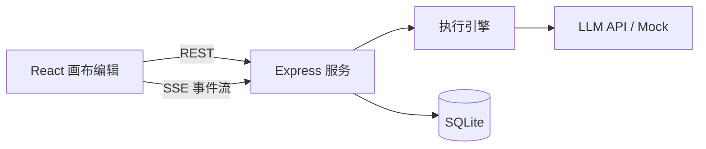

# FlowForge 实施计划

> **For agentic workers:** REQUIRED SUB-SKILL: Use superpowers:subagent-driven-development (recommended) or superpowers:executing-plans to implement this plan task-by-task. Steps use checkbox (`- [ ]`) syntax for tracking.

**Goal:** 实现一个 Dify-like 的 AI 工作流可视化编排系统：画布拖拽编排、后端执行引擎、SSE 实时可观测、本地可跑并部署上线。

**Architecture:** npm workspaces 三包：`shared`（Schema 类型、节点元数据、校验、变量解析，前后端唯一事实来源）、`server`（Express + SQLite + 执行引擎 + LLM/Mock，REST 管理、SSE 推事件）、`client`（React + React Flow + Zustand，画布编辑与运行视图）。执行引擎采用 Node-RED 风格 OR-join：节点收到任一上游交付即触发；事件经 RunEventBus 缓冲并推送给 SSE。

**Tech Stack:** Node >= 20、TypeScript strict、React 18 + @xyflow/react ^12 + zustand ^5、Express ^4 + better-sqlite3 ^11 + cors ^2、Vitest（workspace 三项目）+ supertest、react-router-dom ^6。

## Global Constraints

- 本机 Node 24 / npm 11；项目要求 Node >= 20
- 包名：`@flowforge/shared`、`@flowforge/server`、`@flowforge/client`；根 `package.json` 用 npm workspaces（`workspaces: ["shared", "server", "client"]`）
- TypeScript `strict: true`，不允许 `any`（确需时用 `unknown` + 收窄）
- 事件类型唯一来源：`shared/src/events.ts`；节点元数据唯一来源：`shared/src/nodeTypes.ts`；两者禁止在 server/client 重复定义
- 提交消息用 Conventional Commits（`feat:` / `fix:` / `test:` / `docs:` / `chore:`）
- 每个 Task 结束必须：单测通过 + `git commit`
- 已知限制（来自规格 6.2）：多上游 AND-join 不在 MVP 范围
- 节点类型固定六种：`start | llm | code | condition | http | end`

## File Structure

```
FlowForge/
├─ package.json / tsconfig.base.json / vitest.workspace.ts / .github/workflows/ci.yml
├─ shared/
│  └─ src/
│     ├─ index.ts            # 对外出口
│     ├─ schema.ts           # WorkflowSchema / WorkflowNode / WorkflowEdge / Port 类型
│     ├─ nodeTypes.ts        # NodeTypeMeta 注册表（六种节点的端口/表单/默认配置）
│     ├─ events.ts           # RunEvent 联合类型
│     ├─ factory.ts          # createWorkflow / createNode / createEdge
│     ├─ validate.ts         # validateWorkflow（环/引用/必填配置）
│     └─ variables.ts        # {{nodeId.output}} 解析与替换
├─ server/
│  ├─ package.json / tsconfig.json
│  └─ src/
│     ├─ index.ts            # 启动入口（读 config、建库、listen）
│     ├─ app.ts              # createApp(db)：路由挂载 + CORS + 错误处理
│     ├─ config.ts           # 环境变量（PORT/LLM_*/CORS_ORIGIN）
│     ├─ db.ts               # better-sqlite3 建表 + 打开连接
│     ├─ repo.ts             # 数据访问（workflows/runs/run_nodes 查询）
│     ├─ seed.ts             # 三个预置演示工作流（幂等 seed）
│     ├─ events.ts           # RunEventBus（缓冲 + 订阅）与运行级 AbortController 注册表
│     ├─ routes/workflows.ts # /api/workflows CRUD
│     ├─ routes/runs.ts      # /api/runs、/events(SSE)、/cancel
│     ├─ routes/mock.ts      # /api/mock/search
│     └─ engine/
│        ├─ engine.ts        # executeWorkflow：校验→事件驱动调度→并发→结果
│        ├─ topo.ts          # Kahn 拓扑排序（环检测兜底）
│        ├─ executors.ts     # 六种节点执行器注册表
│        ├─ sandbox.ts       # vm 沙箱（code 节点 / 条件表达式）
│        └─ llm.ts           # OpenAI 兼容客户端 + Mock 流式
├─ client/
│  ├─ package.json / tsconfig.json / vite.config.ts
│  └─ src/
│     ├─ main.tsx / App.tsx / styles.css
│     ├─ api/client.ts       # REST 封装
│     ├─ api/sse.ts          # EventSource 订阅封装
│     ├─ lib/flowMapping.ts  # ReactFlow Node/Edge ↔ WorkflowSchema
│     ├─ stores/workflowStore.ts
│     ├─ stores/editorStore.ts   # 命令模式撤销/重做
│     ├─ stores/runStore.ts
│     ├─ pages/WorkflowList.tsx
│     ├─ pages/Editor.tsx
│     └─ components/
│        ├─ canvas/FlowCanvas.tsx / NodePalette.tsx / CustomNode.tsx
│        ├─ panel/PropertyPanel.tsx / fields.tsx
│        └─ run/RunPanel.tsx / NodeLogDrawer.tsx
└─ docs/superpowers/specs/2026-08-04-flowforge-design.md
```

## Task 1: Monorepo 脚手架 + 测试基线

**Files:**
- Create: `package.json`、`tsconfig.base.json`、`vitest.workspace.ts`
- Create: `shared/package.json`、`shared/tsconfig.json`、`shared/src/index.ts`
- Test: `shared/src/index.spec.ts`

**Interfaces:**
- Produces: `@flowforge/shared` 包可被 `import`，`npm run test:run` 可执行

- [ ] **Step 1: 写根 package.json**

```json
{
  "name": "flowforge",
  "private": true,
  "workspaces": ["shared", "server", "client"],
  "scripts": {
    "dev": "concurrently -n server,client \"npm -w server run dev\" \"npm -w client run dev\"",
    "type-check": "npm -w shared run type-check && npm -w server run type-check && npm -w client run type-check",
    "test:run": "vitest run",
    "build": "npm -w client run build"
  },
  "devDependencies": {
    "concurrently": "^9.2.1",
    "typescript": "^5.9.3",
    "vitest": "^3.2.4"
  }
}
```

- [ ] **Step 2: 写 tsconfig.base.json 与 vitest.workspace.ts**

```json
{
  "compilerOptions": {
    "target": "ES2022",
    "module": "ESNext",
    "moduleResolution": "Bundler",
    "strict": true,
    "skipLibCheck": true,
    "forceConsistentCasingInFileNames": true,
    "esModuleInterop": true,
    "resolveJsonModule": true,
    "noEmit": true
  }
}
```

```ts
import { defineWorkspace } from 'vitest/config'
import react from '@vitejs/plugin-react'
import { fileURLToPath } from 'node:url'

const sharedEntry = fileURLToPath(new URL('./shared/src/index.ts', import.meta.url))

export default defineWorkspace([
  { test: { name: 'shared', include: ['shared/src/**/*.spec.ts'], environment: 'node' } },
  { test: { name: 'server', include: ['server/src/**/*.spec.ts'], environment: 'node' } },
  {
    test: {
      name: 'client',
      include: ['client/src/**/*.spec.ts', 'client/src/**/*.spec.tsx'],
      environment: 'jsdom',
      plugins: [react()],
      resolve: { alias: { '@flowforge/shared': sharedEntry } },
    },
  },
])
```

- [ ] **Step 3: 写 shared 包并加冒烟测试**

`shared/package.json`：

```json
{
  "name": "@flowforge/shared",
  "version": "0.0.0",
  "private": true,
  "main": "src/index.ts",
  "types": "src/index.ts",
  "scripts": { "type-check": "tsc --noEmit" }
}
```

`shared/tsconfig.json`：

```json
{ "extends": "../tsconfig.base.json", "include": ["src"] }
```

`shared/src/index.ts`：

```ts
export const SHARED_PKG = 'shared' as const
```

`shared/src/index.spec.ts`：

```ts
import { describe, expect, it } from 'vitest'
import { SHARED_PKG } from './index'

describe('shared smoke', () => {
  it('exports the package marker', () => {
    expect(SHARED_PKG).toBe('shared')
  })
})
```

- [ ] **Step 4: 安装依赖并跑测试**

Run: `npm install && npm run test:run`
Expected: 1 个测试通过（shared 项目）

- [ ] **Step 5: 提交**

```bash
git add package.json tsconfig.base.json vitest.workspace.ts shared
git commit -m "chore: monorepo 脚手架（shared 包 + vitest workspace）"
```

## Task 2: shared 数据模型与节点元数据

**Files:**
- Create: `shared/src/schema.ts`、`shared/src/nodeTypes.ts`、`shared/src/events.ts`、`shared/src/factory.ts`
- Modify: `shared/src/index.ts`（导出）
- Test: `shared/src/schema.spec.ts`

**Interfaces:**
- Consumes: 无（Task 1 的包结构）
- Produces:
  - `WorkflowSchema` / `WorkflowNode` / `WorkflowEdge` / `Position`（见下）
  - `NodeType = 'start' | 'llm' | 'code' | 'condition' | 'http' | 'end'`
  - `NODE_TYPE_METAS: Record<NodeType, NodeTypeMeta>`、`NODE_TYPES: NodeType[]`
  - `RunEvent` 联合类型
  - `createWorkflow(name): WorkflowSchema`、`createNode(type, position): WorkflowNode`、`createEdge(source, sourcePort, target, targetPort): WorkflowEdge`

- [ ] **Step 1: 写失败测试**

`shared/src/schema.spec.ts`：

```ts
import { describe, expect, it } from 'vitest'
import { NODE_TYPES, NODE_TYPE_METAS } from './nodeTypes'
import { createWorkflow, createNode, createEdge } from './factory'

describe('node metadata', () => {
  it('defines exactly six node types with ports and config fields', () => {
    expect(NODE_TYPES).toHaveLength(6)
    for (const t of NODE_TYPES) {
      const meta = NODE_TYPE_METAS[t]
      expect(meta.label.length).toBeGreaterThan(0)
      expect(meta.configFields.length).toBeGreaterThanOrEqual(0)
      expect(meta.requiredConfig).toBeInstanceOf(Array)
    }
    expect(NODE_TYPE_METAS.start.inputs).toHaveLength(0)
    expect(NODE_TYPE_METAS.condition.outputs.map((o) => o.name)).toEqual(['result', 'true', 'false'])
  })
})

describe('factories', () => {
  it('creates a workflow with id and timestamps', () => {
    const wf = createWorkflow('demo')
    expect(wf.id).toBeTruthy()
    expect(wf.nodes).toEqual([])
    expect(wf.createdAt).toMatch(/^\d{4}-\d{2}-\d{2}T/)
  })

  it('creates nodes with random ids and edges linking them', () => {
    const a = createNode('start', { x: 0, y: 0 })
    const b = createNode('llm', { x: 100, y: 0 })
    const e = createEdge(a.id, 'payload', b.id, 'prompt')
    expect(a.id).not.toBe(b.id)
    expect(e).toEqual({ id: expect.any(String), source: a.id, sourcePort: 'payload', target: b.id, targetPort: 'prompt' })
  })
})
```

- [ ] **Step 2: 运行确认失败**

Run: `npx vitest run --project shared shared/src/schema.spec.ts`
Expected: FAIL（模块不存在）

- [ ] **Step 3: 实现 schema.ts / nodeTypes.ts / events.ts / factory.ts**

`shared/src/schema.ts`：

```ts
export type NodeType = 'start' | 'llm' | 'code' | 'condition' | 'http' | 'end'
export interface Position { x: number; y: number }
export interface WorkflowNode {
  id: string
  type: NodeType
  position: Position
  config: Record<string, unknown>
}
export interface WorkflowEdge {
  id: string
  source: string
  sourcePort: string
  target: string
  targetPort: string
}
export interface WorkflowSchema {
  id: string
  name: string
  nodes: WorkflowNode[]
  edges: WorkflowEdge[]
  createdAt: string
  updatedAt: string
}
export type PortType = 'string' | 'number' | 'boolean' | 'object' | 'array' | 'any'
export interface NodePort { name: string; label: string; type: PortType }
export type ConfigFieldKind = 'text' | 'textarea' | 'select' | 'number' | 'code'
export interface ConfigField {
  key: string
  label: string
  kind: ConfigFieldKind
  options?: string[]
  placeholder?: string
  default?: unknown
}
export interface NodeTypeMeta {
  type: NodeType
  label: string
  description: string
  inputs: NodePort[]
  outputs: NodePort[]
  requiredConfig: string[]
  configFields: ConfigField[]
  defaultConfig: Record<string, unknown>
}
```

`shared/src/nodeTypes.ts`：

```ts
import type { NodeType, NodeTypeMeta } from './schema'

export const NODE_TYPES: NodeType[] = ['start', 'llm', 'code', 'condition', 'http', 'end']

export const NODE_TYPE_METAS: Record<NodeType, NodeTypeMeta> = {
  start: {
    type: 'start', label: '开始', description: '运行入口，提供输入参数 payload',
    inputs: [], outputs: [{ name: 'payload', label: '输入参数', type: 'any' }],
    requiredConfig: [], configFields: [], defaultConfig: {},
  },
  llm: {
    type: 'llm', label: 'LLM', description: '调用大模型生成文本，支持流式输出',
    inputs: [{ name: 'prompt', label: '提示词', type: 'string' }],
    outputs: [
      { name: 'output', label: '输出文本', type: 'string' },
      { name: 'tokens', label: 'Token 数', type: 'number' },
      { name: 'model', label: '模型', type: 'string' },
    ],
    requiredConfig: ['userPrompt'],
    configFields: [
      { key: 'userPrompt', label: '用户提示词', kind: 'textarea', default: '请回答：{{start.payload}}' },
      { key: 'systemPrompt', label: '系统提示词', kind: 'textarea', default: '你是一个乐于助人的助手。' },
      { key: 'model', label: '模型', kind: 'select', options: ['gpt-4o-mini', 'gpt-4o', 'deepseek-chat'], default: 'gpt-4o-mini' },
      { key: 'temperature', label: '温度', kind: 'number', default: 0.7 },
    ],
    defaultConfig: { userPrompt: '请回答：{{start.payload}}', systemPrompt: '你是一个乐于助人的助手。', model: 'gpt-4o-mini', temperature: 0.7 },
  },
  code: {
    type: 'code', label: '代码', description: '在沙箱中运行 JS 函数，转换数据',
    inputs: [{ name: 'input', label: '输入', type: 'any' }],
    outputs: [{ name: 'output', label: '输出', type: 'any' }],
    requiredConfig: ['code'],
    configFields: [
      { key: 'code', label: '函数体', kind: 'code', placeholder: 'function run(inputs) { return { output: inputs.input } }' },
    ],
    defaultConfig: { code: 'function run(inputs) { return { output: inputs.input } }' },
  },
  condition: {
    type: 'condition', label: '条件分支', description: '求值表达式，按 true/false 端口分流',
    inputs: [{ name: 'value', label: '输入值', type: 'any' }],
    outputs: [
      { name: 'result', label: '结果', type: 'boolean' },
      { name: 'true', label: '命中', type: 'boolean' },
      { name: 'false', label: '未命中', type: 'boolean' },
    ],
    requiredConfig: ['expression'],
    configFields: [
      { key: 'expression', label: '表达式', kind: 'text', placeholder: 'String(input).includes("yes")' },
    ],
    defaultConfig: { expression: 'String(input).includes("yes")' },
  },
  http: {
    type: 'http', label: 'HTTP', description: '请求外部接口（含内置 mock 检索）',
    inputs: [{ name: 'body', label: '请求体', type: 'any' }],
    outputs: [
      { name: 'status', label: '状态码', type: 'number' },
      { name: 'data', label: '响应数据', type: 'any' },
    ],
    requiredConfig: ['url'],
    configFields: [
      { key: 'url', label: 'URL', kind: 'text', placeholder: '/api/mock/search?q={{start.payload}}' },
      { key: 'method', label: '方法', kind: 'select', options: ['GET', 'POST'], default: 'GET' },
      { key: 'body', label: '请求体(JSON)', kind: 'textarea' },
    ],
    defaultConfig: { url: '/api/mock/search?q={{start.payload}}', method: 'GET' },
  },
  end: {
    type: 'end', label: '结束', description: '运行终点，输出 result',
    inputs: [{ name: 'result', label: '结果', type: 'any' }],
    outputs: [],
    requiredConfig: [], configFields: [], defaultConfig: {},
  },
}
```

`shared/src/events.ts`：

```ts
export type RunStatus = 'running' | 'success' | 'failed' | 'cancelled'

export type RunEvent =
  | { type: 'run_started'; runId: string; timestamp: number }
  | { type: 'node_started'; runId: string; nodeId: string; timestamp: number }
  | { type: 'token_stream'; runId: string; nodeId: string; text: string; timestamp: number }
  | { type: 'node_finished'; runId: string; nodeId: string; output: Record<string, unknown>; durationMs: number; timestamp: number }
  | { type: 'node_failed'; runId: string; nodeId: string; error: string; timestamp: number }
  | { type: 'run_completed'; runId: string; status: RunStatus; timestamp: number }
```

`shared/src/factory.ts`：

```ts
import type { NodeType, Position, WorkflowEdge, WorkflowNode, WorkflowSchema } from './schema'

function newId(): string {
  return globalThis.crypto?.randomUUID?.() ?? `${Math.random().toString(36).slice(2)}${Date.now().toString(36)}`
}

export function createWorkflow(name: string): WorkflowSchema {
  const now = new Date().toISOString()
  return { id: newId(), name, nodes: [], edges: [], createdAt: now, updatedAt: now }
}

export function createNode(type: NodeType, position: Position): WorkflowNode {
  return { id: newId(), type, position, config: {} }
}

export function createEdge(source: string, sourcePort: string, target: string, targetPort: string): WorkflowEdge {
  return { id: newId(), source, sourcePort, target, targetPort }
}
```

`shared/src/index.ts` 追加导出：

```ts
export * from './schema'
export * from './nodeTypes'
export * from './events'
export * from './factory'
```

- [ ] **Step 4: 运行确认通过**

Run: `npx vitest run --project shared shared/src/schema.spec.ts`
Expected: PASS（3 个测试）

- [ ] **Step 5: 提交**

```bash
git add shared
git commit -m "feat(shared): Schema 类型、六种节点元数据、事件类型与工厂函数"
```

## Task 3: shared 变量解析

**Files:**
- Create: `shared/src/variables.ts`
- Modify: `shared/src/index.ts`（导出）
- Test: `shared/src/variables.spec.ts`

**Interfaces:**
- Consumes: 无
- Produces:
  - `interface VariableRef { nodeId: string; output: string }`
  - `REF_PATTERN: RegExp`
  - `extractVariableRefs(text: string): VariableRef[]`
  - `replaceVariables(text: string, values: Record<string, Record<string, unknown>>): { text: string; missing: VariableRef[] }`

- [ ] **Step 1: 写失败测试**

`shared/src/variables.spec.ts`：

```ts
import { describe, expect, it } from 'vitest'
import { extractVariableRefs, replaceVariables } from './variables'

describe('variables', () => {
  it('extracts refs in {{node.output}} syntax', () => {
    expect(extractVariableRefs('a {{llm1.output}} b {{start.payload}}')).toEqual([
      { nodeId: 'llm1', output: 'output' },
      { nodeId: 'start', output: 'payload' },
    ])
  })

  it('replaces known refs and reports missing ones', () => {
    const r = replaceVariables('x={{a.output}} y={{b.output}}', { a: { output: 42 } })
    expect(r.text).toBe('x=42 y={{b.output}}')
    expect(r.missing).toEqual([{ nodeId: 'b', output: 'output' }])
  })

  it('returns original text when no refs exist', () => {
    expect(replaceVariables('hello', {}).text).toBe('hello')
  })
})
```

- [ ] **Step 2: 运行确认失败**

Run: `npx vitest run --project shared shared/src/variables.spec.ts`
Expected: FAIL

- [ ] **Step 3: 实现 variables.ts**

```ts
export interface VariableRef { nodeId: string; output: string }

export const REF_PATTERN = /\{\{\s*([A-Za-z0-9_-]+)\.([A-Za-z0-9_-]+)\s*\}\}/g

export function extractVariableRefs(text: string): VariableRef[] {
  const refs: VariableRef[] = []
  for (const m of text.matchAll(REF_PATTERN)) {
    refs.push({ nodeId: m[1], output: m[2] })
  }
  return refs
}

export function replaceVariables(
  text: string,
  values: Record<string, Record<string, unknown>>,
): { text: string; missing: VariableRef[] } {
  const missing: VariableRef[] = []
  const next = text.replace(REF_PATTERN, (raw, nodeId: string, output: string) => {
    const value = values[nodeId]?.[output]
    if (value === undefined || value === null) {
      missing.push({ nodeId, output })
      return raw
    }
    return String(value)
  })
  return { text: next, missing }
}
```

- [ ] **Step 4: 运行确认通过**

Run: `npx vitest run --project shared shared/src/variables.spec.ts`
Expected: PASS（3 个测试）

- [ ] **Step 5: 提交**

```bash
git add shared
git commit -m "feat(shared): {{node.output}} 变量解析与替换"
```

## Task 4: shared 校验（环 / 引用 / 必填配置）

**Files:**
- Create: `shared/src/validate.ts`
- Modify: `shared/src/index.ts`（导出）
- Test: `shared/src/validate.spec.ts`

**Interfaces:**
- Consumes: `WorkflowSchema`、`NODE_TYPE_METAS`（Task 2）
- Consumes: `REF_PATTERN`（Task 3 变量解析）
- Produces:
  - `interface ValidationIssue { code: string; message: string }`
  - `validateWorkflow(wf: WorkflowSchema): ValidationIssue[]`
  - `hasErrors(issues: ValidationIssue[]): boolean`

- [ ] **Step 1: 写失败测试**

`shared/src/validate.spec.ts`：

```ts
import { describe, expect, it } from 'vitest'
import { createWorkflow, createNode, createEdge } from './factory'
import { validateWorkflow } from './validate'

function baseWorkflow() {
  const wf = createWorkflow('t')
  const start = createNode('start', { x: 0, y: 0 })
  const code = createNode('code', { x: 100, y: 0 })
  code.config.code = 'function run(inputs) { return { output: 1 } }'
  const end = createNode('end', { x: 200, y: 0 })
  wf.nodes.push(start, code, end)
  wf.edges.push(createEdge(start.id, 'payload', code.id, 'input'), createEdge(code.id, 'output', end.id, 'result'))
  return wf
}

describe('validateWorkflow', () => {
  it('accepts a valid linear workflow', () => {
    expect(validateWorkflow(baseWorkflow())).toEqual([])
  })

  it('rejects a workflow without start or end', () => {
    const wf = baseWorkflow()
    wf.nodes = wf.nodes.filter((n) => n.type !== 'end')
    expect(validateWorkflow(wf).some((i) => i.code === 'MISSING_END')).toBe(true)
  })

  it('detects cycles', () => {
    const wf = baseWorkflow()
    const [a, b] = wf.nodes
    wf.edges.push(createEdge(b.id, 'output', a.id, 'input'))
    expect(validateWorkflow(wf).some((i) => i.code === 'CYCLE')).toBe(true)
  })

  it('rejects references to unknown outputs', () => {
    const wf = baseWorkflow()
    wf.edges[0] = createEdge(wf.nodes[0].id, 'payload', wf.nodes[1].id, 'nope')
    expect(validateWorkflow(wf).some((i) => i.code === 'UNKNOWN_PORT')).toBe(true)
  })

  it('rejects missing required config', () => {
    const wf = baseWorkflow()
    delete wf.nodes[1].config.code
    expect(validateWorkflow(wf).some((i) => i.code === 'MISSING_CONFIG')).toBe(true)
  })
})
```

- [ ] **Step 2: 运行确认失败**

Run: `npx vitest run --project shared shared/src/validate.spec.ts`
Expected: FAIL（validateWorkflow 不存在）

- [ ] **Step 3: 实现 validate.ts**

```ts
import { NODE_TYPE_METAS } from './nodeTypes'
import type { WorkflowEdge, WorkflowSchema } from './schema'
import { REF_PATTERN } from './variables'

export interface ValidationIssue { code: string; message: string }

export function hasErrors(issues: ValidationIssue[]): boolean {
  return issues.length > 0
}

export function validateWorkflow(wf: WorkflowSchema): ValidationIssue[] {
  const issues: ValidationIssue[] = []
  if (wf.nodes.length === 0) {
    issues.push({ code: 'EMPTY', message: '工作流没有任何节点' })
    return issues
  }
  const starts = wf.nodes.filter((n) => n.type === 'start')
  const ends = wf.nodes.filter((n) => n.type === 'end')
  if (starts.length === 0) issues.push({ code: 'MISSING_START', message: '缺少开始节点' })
  if (starts.length > 1) issues.push({ code: 'MULTIPLE_START', message: '只能有一个开始节点' })
  if (ends.length === 0) issues.push({ code: 'MISSING_END', message: '缺少结束节点' })

  const nodeIds = new Set(wf.nodes.map((n) => n.id))
  const incoming = new Map<string, WorkflowEdge[]>()
  for (const n of wf.nodes) incoming.set(n.id, [])
  for (const e of wf.edges) {
    if (!nodeIds.has(e.source)) issues.push({ code: 'UNKNOWN_NODE', message: `边引用了不存在的节点 ${e.source}` })
    if (!nodeIds.has(e.target)) issues.push({ code: 'UNKNOWN_NODE', message: `边引用了不存在的节点 ${e.target}` })
    incoming.get(e.target)?.push(e)
  }

  const metaOf = (id: string) => {
    const node = wf.nodes.find((n) => n.id === id)
    return node ? NODE_TYPE_METAS[node.type] : undefined
  }
  for (const n of wf.nodes) {
    const meta = NODE_TYPE_METAS[n.type]
    if (n.type !== 'start' && (incoming.get(n.id)?.length ?? 0) === 0) {
      issues.push({ code: 'NO_INPUT', message: `节点 ${n.id} 没有入边` })
    }
    if (n.type === 'start' && (incoming.get(n.id)?.length ?? 0) > 0) {
      issues.push({ code: 'START_HAS_INPUT', message: '开始节点不能有入边' })
    }
    if (n.type === 'end' && wf.edges.some((e) => e.source === n.id)) {
      issues.push({ code: 'END_HAS_OUTPUT', message: '结束节点不能有出边' })
    }
    for (const e of wf.edges.filter((x) => x.target === n.id)) {
      const valid = metaOf(e.source)?.outputs.some((p) => p.name === e.sourcePort)
      if (!valid) issues.push({ code: 'UNKNOWN_PORT', message: `${e.source}.${e.sourcePort} 不是有效输出端口` })
    }
    for (const key of meta.requiredConfig) {
      const v = n.config[key]
      if (v === undefined || v === null || v === '') {
        issues.push({ code: 'MISSING_CONFIG', message: `${n.id} 缺少必填配置 ${key}` })
      }
    }
    for (const value of Object.values(n.config)) {
      if (typeof value !== 'string') continue
      for (const ref of value.matchAll(REF_PATTERN)) {
        const refNode = ref[1]
        const refPort = ref[2]
        if (!nodeIds.has(refNode)) issues.push({ code: 'UNKNOWN_REF', message: `${n.id} 引用了不存在的节点 ${refNode}` })
        else if (!metaOf(refNode)?.outputs.some((p) => p.name === refPort)) {
          issues.push({ code: 'UNKNOWN_REF', message: `${n.id} 引用了不存在的输出 ${refNode}.${refPort}` })
        }
      }
    }
  }

  // 环检测（Kahn）
  const inDegree = new Map<string, number>()
  const adj = new Map<string, string[]>()
  for (const n of wf.nodes) { inDegree.set(n.id, 0); adj.set(n.id, []) }
  for (const e of wf.edges) {
    if (!nodeIds.has(e.source) || !nodeIds.has(e.target)) continue
    adj.get(e.source)?.push(e.target)
    inDegree.set(e.target, (inDegree.get(e.target) ?? 0) + 1)
  }
  const queue = [...inDegree.entries()].filter(([, d]) => d === 0).map(([id]) => id)
  let visited = 0
  while (queue.length > 0) {
    const id = queue.shift()!
    visited += 1
    for (const next of adj.get(id) ?? []) {
      inDegree.set(next, (inDegree.get(next) ?? 0) - 1)
      if (inDegree.get(next) === 0) queue.push(next)
    }
  }
  if (visited < wf.nodes.length) issues.push({ code: 'CYCLE', message: '工作流存在循环依赖' })
  return issues
}
```

- [ ] **Step 4: 运行确认通过**

Run: `npx vitest run --project shared shared/src/validate.spec.ts`
Expected: PASS（5 个测试）

- [ ] **Step 5: 提交**

```bash
git add shared
git commit -m "feat(shared): 工作流校验（环检测/引用/必填配置）"
```

## Task 5: client 脚手架（Vite + React + Flow + Zustand + 路由）

**Files:**
- Create: `client/package.json`、`client/tsconfig.json`、`client/vite.config.ts`、`client/index.html`
- Create: `client/src/main.tsx`、`client/src/App.tsx`、`client/src/styles.css`
- Test: `client/src/App.spec.tsx`（smoke，jsdom）

**Interfaces:**
- Consumes: `@flowforge/shared`（Task 2-4）
- Produces: 可启动的 `npm -w client run dev`，路由 `/` 与 `/editor/:id` 占位

- [ ] **Step 1: 写失败测试**

`client/src/App.spec.tsx`：

```tsx
import { render, screen } from '@testing-library/react'
import { describe, expect, it } from 'vitest'
import { MemoryRouter } from 'react-router-dom'
import { AppRoutes } from './App'

describe('App', () => {
  it('renders the workflow list placeholder at /', () => {
    render(<MemoryRouter initialEntries={['/']}><AppRoutes /></MemoryRouter>)
    expect(screen.getByText(/FlowForge/)).toBeTruthy()
  })
})
```

- [ ] **Step 2: 运行确认失败**

Run: `npx vitest run --project client client/src/App.spec.tsx`
Expected: FAIL

- [ ] **Step 3: 实现脚手架文件**

`client/package.json`：

```json
{
  "name": "@flowforge/client",
  "version": "0.0.0",
  "private": true,
  "type": "module",
  "scripts": {
    "dev": "vite",
    "build": "tsc --noEmit && vite build",
    "type-check": "tsc --noEmit"
  },
  "dependencies": {
    "@flowforge/shared": "workspace:*",
    "@xyflow/react": "^12.6.0",
    "react": "^18.3.1",
    "react-dom": "^18.3.1",
    "react-router-dom": "^6.30.0",
    "zustand": "^5.0.6"
  },
  "devDependencies": {
    "@testing-library/dom": "^10.4.0",
    "@testing-library/react": "^16.3.0",
    "@types/react": "^18.3.12",
    "@types/react-dom": "^18.3.1",
    "@vitejs/plugin-react": "^4.3.4",
    "jsdom": "^26.0.0",
    "typescript": "^5.9.3",
    "vite": "^6.0.7"
  }
}
```

`client/tsconfig.json`：

```json
{
  "extends": "../tsconfig.base.json",
  "compilerOptions": {
    "jsx": "react-jsx",
    "lib": ["ES2022", "DOM", "DOM.Iterable"],
    "paths": { "@flowforge/shared": ["../shared/src/index.ts"] }
  },
  "include": ["src"]
}
```

`client/vite.config.ts`：

```ts
import react from '@vitejs/plugin-react'
import { defineConfig } from 'vite'
import { fileURLToPath } from 'node:url'

export default defineConfig({
  plugins: [react()],
  resolve: { alias: { '@flowforge/shared': fileURLToPath(new URL('../shared/src/index.ts', import.meta.url)) } },
  server: {
    port: 5173,
    proxy: { '/api': { target: 'http://localhost:3001', changeOrigin: true } },
  },
})
```

`client/index.html`：

```html
<!doctype html>
<html lang="zh-CN">
  <head>
    <meta charset="UTF-8" />
    <meta name="viewport" content="width=device-width, initial-scale=1.0" />
    <title>FlowForge</title>
  </head>
  <body>
    <div id="root"></div>
    <script type="module" src="/src/main.tsx"></script>
  </body>
</html>
```

`client/src/main.tsx`：

```tsx
import React from 'react'
import ReactDOM from 'react-dom/client'
import { BrowserRouter } from 'react-router-dom'
import { ReactFlowProvider } from '@xyflow/react'
import '@xyflow/react/dist/style.css'
import './styles.css'
import App from './App'

ReactDOM.createRoot(document.getElementById('root')!).render(
  <React.StrictMode>
    <BrowserRouter>
      <ReactFlowProvider>
        <App />
      </ReactFlowProvider>
    </BrowserRouter>
  </React.StrictMode>,
)
```

`client/src/App.tsx`（导出 `AppRoutes` 供测试）：

```tsx
import { Route, Routes } from 'react-router-dom'
import WorkflowList from './pages/WorkflowList'
import Editor from './pages/Editor'

export function AppRoutes() {
  return (
    <Routes>
      <Route path="/" element={<WorkflowList />} />
      <Route path="/editor/:id" element={<Editor />} />
    </Routes>
  )
}

export default function App() {
  return <AppRoutes />
}
```

`client/src/pages/WorkflowList.tsx`：

```tsx
export default function WorkflowList() {
  return <div>FlowForge 工作流列表（待实现）</div>
}
```

`client/src/pages/Editor.tsx`：

```tsx
export default function Editor() {
  return <div>FlowForge 编辑器（待实现）</div>
}
```

`client/src/styles.css`：

```css
* { box-sizing: border-box; }
body { margin: 0; font-family: system-ui, -apple-system, sans-serif; background: #0f172a; color: #e2e8f0; }
```

- [ ] **Step 4: 安装并确认通过**

Run: `npm install && npx vitest run --project client client/src/App.spec.tsx`
Expected: PASS

- [ ] **Step 5: 提交**

```bash
git add client
git commit -m "feat(client): Vite + React + React Flow + Zustand 脚手架与路由骨架"
```

## Task 6: 画布基础（节点面板 / 拖放 / 连线 / localStorage 持久化）

**Files:**
- Create: `client/src/lib/flowMapping.ts`、`client/src/stores/workflowStore.ts`
- Create: `client/src/components/canvas/FlowCanvas.tsx`、`NodePalette.tsx`、`CustomNode.tsx`
- Modify: `client/src/pages/Editor.tsx`
- Test: `client/src/lib/flowMapping.spec.ts`

**Interfaces:**
- Consumes: `NODE_TYPE_METAS`、`createNode`、`createEdge`、`createWorkflow`（shared）
- Produces:
  - `toFlowNodes(wf: WorkflowSchema): FlowNode[]`、`toFlowEdges(wf: WorkflowSchema): FlowEdge[]`
  - `toWorkflowSchema(nodes: FlowNode[], edges: FlowEdge[], base: WorkflowSchema): WorkflowSchema`
  - `workflowStore`（Zustand）：`current`、`loadFromLocal(id)`、`saveToLocal()`、`newWorkflow(name)`

- [ ] **Step 1: 写失败测试（映射往返）**

`client/src/lib/flowMapping.spec.ts`：

```ts
import { describe, expect, it } from 'vitest'
import { createWorkflow, createNode, createEdge } from '@flowforge/shared'
import { toFlowNodes, toFlowEdges, toWorkflowSchema } from './flowMapping'

describe('flowMapping', () => {
  it('round-trips schema to flow nodes/edges and back', () => {
    const wf = createWorkflow('t')
    const a = createNode('start', { x: 10, y: 20 })
    const b = createNode('llm', { x: 100, y: 20 })
    b.config.userPrompt = '{{start.payload}}'
    const e = createEdge(a.id, 'payload', b.id, 'prompt')
    wf.nodes.push(a, b)
    wf.edges.push(e)

    const nodes = toFlowNodes(wf)
    const edges = toFlowEdges(wf)
    expect(nodes[0].position.x).toBe(10)
    expect(edges[0].source).toBe(a.id)

    const back = toWorkflowSchema(nodes, edges, wf)
    expect(back.nodes).toHaveLength(2)
    expect(back.nodes.find((n) => n.id === b.id)?.config.userPrompt).toBe('{{start.payload}}')
    expect(back.edges[0].targetPort).toBe('prompt')
  })
})
```

- [ ] **Step 2: 运行确认失败**

Run: `npx vitest run --project client client/src/lib/flowMapping.spec.ts`
Expected: FAIL

- [ ] **Step 3: 实现 flowMapping.ts 与 workflowStore**

`client/src/lib/flowMapping.ts`：

```ts
import type { Edge, Node } from '@xyflow/react'
import type { WorkflowEdge, WorkflowNode, WorkflowSchema } from '@flowforge/shared'

export type FlowNode = Node<{ type: WorkflowNode['type']; config: Record<string, unknown>; status?: string; isCurrent?: boolean }>
export type FlowEdge = Edge

export function toFlowNodes(wf: WorkflowSchema): FlowNode[] {
  return wf.nodes.map((n) => ({
    id: n.id,
    type: 'custom',
    position: n.position,
    data: { type: n.type, config: n.config },
  }))
}

export function toFlowEdges(wf: WorkflowSchema): FlowEdge[] {
  return wf.edges.map((e) => ({
    id: e.id,
    source: e.source,
    sourceHandle: e.sourcePort,
    target: e.target,
    targetHandle: e.targetPort,
  }))
}

export function toWorkflowSchema(nodes: FlowNode[], edges: FlowEdge[], base: WorkflowSchema): WorkflowSchema {
  return {
    ...base,
    updatedAt: new Date().toISOString(),
    nodes: nodes.map((n) => ({
      id: n.id,
      type: n.data.type,
      position: { x: n.position.x, y: n.position.y },
      config: n.data.config,
    })),
    edges: edges.map((e) => ({
      id: e.id,
      source: e.source,
      sourcePort: e.sourceHandle ?? 'output',
      target: e.target,
      targetPort: e.targetHandle ?? 'input',
    })),
  }
}
```

`client/src/stores/workflowStore.ts`：

```ts
import { create } from 'zustand'
import { createWorkflow, type WorkflowSchema } from '@flowforge/shared'

const LS_KEY = 'flowforge.workflows'

interface WorkflowState {
  workflows: WorkflowSchema[]
  current: WorkflowSchema | null
  newWorkflow(name: string): WorkflowSchema
  loadFromLocal(id: string): void
  saveToLocal(): void
  applyCurrent(updater: (wf: WorkflowSchema) => WorkflowSchema): void
}

function readAll(): WorkflowSchema[] {
  try {
    return JSON.parse(localStorage.getItem(LS_KEY) ?? '[]') as WorkflowSchema[]
  } catch {
    return []
  }
}

export const useWorkflowStore = create<WorkflowState>((set, get) => ({
  workflows: readAll(),
  current: null,
  newWorkflow(name) {
    const wf = createWorkflow(name)
    set({ workflows: [...get().workflows, wf], current: wf })
    get().saveToLocal()
    return wf
  },
  loadFromLocal(id) {
    const wf = get().workflows.find((w) => w.id === id) ?? null
    set({ current: wf })
  },
  saveToLocal() {
    const { workflows, current } = get()
    const next = current
      ? workflows.map((w) => (w.id === current.id ? current : w))
      : workflows
    localStorage.setItem(LS_KEY, JSON.stringify(next))
    set({ workflows: next })
  },
  applyCurrent(updater) {
    const cur = get().current
    if (!cur) return
    const next = updater({ ...cur })
    next.updatedAt = new Date().toISOString()
    set({ current: next })
    get().saveToLocal()
  },
}))
```

- [ ] **Step 4: 实现画布组件与 Editor 页面**

`client/src/components/canvas/CustomNode.tsx`：

```tsx
import { Handle, Position, type NodeProps } from '@xyflow/react'
import { NODE_TYPE_METAS } from '@flowforge/shared'
import type { FlowNode } from '../../lib/flowMapping'

const STATUS_COLOR: Record<string, string> = {
  pending: '#64748b', running: '#3b82f6', success: '#22c55e', error: '#ef4444',
}

export default function CustomNode({ id, data, selected }: NodeProps<FlowNode>) {
  const meta = NODE_TYPE_METAS[data.type]
  const color = data.status ? STATUS_COLOR[data.status] : '#94a3b8'
  return (
    <div style={{ background: '#1e293b', border: selected ? '2px solid #3b82f6' : '1px solid #475569', borderRadius: 10, padding: '10px 14px', minWidth: 140, boxShadow: '0 4px 12px rgba(0,0,0,.35)' }}>
      {meta.inputs.map((p) => (
        <Handle key={p.name} id={p.name} type="target" position={Position.Left} style={{ background: color, width: 8, height: 8 }} />
      ))}
      <div style={{ display: 'flex', alignItems: 'center', gap: 8 }}>
        <span style={{ width: 10, height: 10, borderRadius: '50%', background: color, animation: data.status === 'running' ? 'pulse 1s infinite' : undefined }} />
        <strong>{meta.label}</strong>
      </div>
      <div style={{ fontSize: 11, color: '#94a3b8', marginTop: 4 }}>{id.slice(0, 8)}</div>
      {meta.outputs.map((p) => (
        <Handle key={p.name} id={p.name} type="source" position={Position.Right} style={{ background: color, width: 8, height: 8 }} />
      ))}
    </div>
  )
}
```

`client/src/components/canvas/NodePalette.tsx`：

```tsx
import { NODE_TYPES, NODE_TYPE_METAS } from '@flowforge/shared'

export default function NodePalette({ onPick }: { onPick: (type: NodeType) => void }) {
  return (
    <aside style={{ width: 180, padding: 12, borderRight: '1px solid #334155', background: '#0b1220' }}>
      <h3 style={{ fontSize: 13, margin: '0 0 10px' }}>节点</h3>
      {NODE_TYPES.map((t) => (
        <button
          key={t}
          draggable
          onDragStart={(e) => e.dataTransfer.setData('application/flowforge-node', t)}
          onClick={() => onPick(t)}
          style={{ display: 'block', width: '100%', marginBottom: 8, padding: '8px 10px', textAlign: 'left', background: '#1e293b', border: '1px solid #334155', borderRadius: 8, color: '#e2e8f0', cursor: 'grab' }}
        >
          <div style={{ fontWeight: 600 }}>{NODE_TYPE_METAS[t].label}</div>
          <div style={{ fontSize: 11, color: '#94a3b8' }}>{NODE_TYPE_METAS[t].description}</div>
        </button>
      ))}
    </aside>
  )
}
```

`client/src/components/canvas/FlowCanvas.tsx`：

```tsx
import { useCallback, useMemo } from 'react'
import { Background, Controls, MiniMap, ReactFlow, addEdge, useReactFlow } from '@xyflow/react'
import { createEdge, createNode, type NodeType } from '@flowforge/shared'
import { useWorkflowStore } from '../../stores/workflowStore'
import { toFlowEdges, toFlowNodes, type FlowNode } from '../../lib/flowMapping'
import CustomNode from './CustomNode'

const nodeTypes = { custom: CustomNode }

export default function FlowCanvas() {
  const { current, applyCurrent } = useWorkflowStore()
  const rf = useReactFlow<FlowNode>()

  const nodes = useMemo(() => (current ? toFlowNodes(current) : []), [current])
  const edges = useMemo(() => (current ? toFlowEdges(current) : []), [current])

  const addNodeOfType = useCallback((type: NodeType) => {
    const pos = rf.screenToFlowPosition({ x: window.innerWidth / 2 - 80, y: window.innerHeight / 2 - 40 })
    const node = createNode(type, pos)
    applyCurrent((wf) => ({ ...wf, nodes: [...wf.nodes, node] }))
  }, [applyCurrent, rf])

  const onConnect = useCallback((conn: Parameters<typeof addEdge>[0]) => {
    if (!current) return
    const edge = createEdge(conn.source, conn.sourceHandle ?? 'output', conn.target, conn.targetHandle ?? 'input')
    applyCurrent((wf) => ({ ...wf, edges: [...wf.edges, edge] }))
  }, [applyCurrent, current])

  const onDragOver = useCallback((e: React.DragEvent) => {
    e.preventDefault()
    e.dataTransfer.dropEffect = 'move'
  }, [])

  const onDrop = useCallback(
    (e: React.DragEvent) => {
      e.preventDefault()
      const type = e.dataTransfer.getData('application/flowforge-node') as NodeType
      if (!type) return
      const pos = rf.screenToFlowPosition({ x: e.clientX, y: e.clientY })
      const node = createNode(type, pos)
      applyCurrent((wf) => ({ ...wf, nodes: [...wf.nodes, node] }))
    },
    [applyCurrent, rf],
  )

  return (
    <div style={{ flex: 1, height: '100%' }} onDragOver={onDragOver} onDrop={onDrop}>
      <ReactFlow nodes={nodes} edges={edges} nodeTypes={nodeTypes} onConnect={onConnect} fitView>
        <Background />
        <Controls />
        <MiniMap />
      </ReactFlow>
    </div>
  )
}
```

`client/src/pages/Editor.tsx`：

```tsx
import { useEffect } from 'react'
import { useParams } from 'react-router-dom'
import { useWorkflowStore } from '../stores/workflowStore'
import FlowCanvas from '../components/canvas/FlowCanvas'
import NodePalette from '../components/canvas/NodePalette'

export default function Editor() {
  const { id } = useParams()
  const { loadFromLocal } = useWorkflowStore()
  useEffect(() => {
    if (id) loadFromLocal(id)
  }, [id, loadFromLocal])

  return (
    <div style={{ display: 'flex', height: '100vh' }}>
      <NodePalette onPick={() => {}} />
      <FlowCanvas />
    </div>
  )
}
```

- [ ] **Step 5: 运行测试 + 手动验收**

Run: `npx vitest run --project client client/src/lib/flowMapping.spec.ts`
Expected: PASS

Manual: `npm -w client run dev` 打开 `/editor/:id`（先用 `newWorkflow` 造一条记录，或直接接受空画布），验证：从左侧拖节点入画布、节点显示标签与端口、节点之间可以连线、`localStorage` 中出现 `flowforge.workflows`。

- [ ] **Step 6: 提交**

```bash
git add client
git commit -m "feat(client): 画布基础（拖放/连线/节点渲染/localStorage 持久化）"
```

## Task 7: 属性面板 + 命令模式撤销/重做

**Files:**
- Create: `client/src/stores/editorStore.ts`、`client/src/components/panel/fields.tsx`、`client/src/components/panel/PropertyPanel.tsx`
- Modify: `client/src/pages/Editor.tsx`（布局加入右侧面板）
- Test: `client/src/stores/editorStore.spec.ts`

**Interfaces:**
- Consumes: `workflowStore.applyCurrent`（Task 6）
- Produces:
  - `editorStore`：`selectedNodeId`、`setSelectedNodeId(id)`、`execute(cmd)`、`undo()`、`redo()`、`canUndo/canRedo`
  - `Command = { label: string; run(): void; undo(): void }`

- [ ] **Step 1: 写失败测试（命令历史）**

`client/src/stores/editorStore.spec.ts`：

```ts
import { beforeEach, describe, expect, it } from 'vitest'
import { createWorkflow, type WorkflowSchema } from '@flowforge/shared'
import { useWorkflowStore } from './workflowStore'
import { useEditorStore } from './editorStore'

describe('editorStore commands', () => {
  beforeEach(() => {
    localStorage.clear()
    const wf: WorkflowSchema = createWorkflow('t')
    useWorkflowStore.setState({ workflows: [wf], current: wf })
    useEditorStore.setState({ past: [], future: [], selectedNodeId: null })
  })

  it('executes commands and undoes them in order', () => {
    const counts: number[] = []
    useEditorStore.getState().execute({
      label: 'a',
      run: () => counts.push(1),
      undo: () => counts.push(-1),
    })
    useEditorStore.getState().execute({
      label: 'b',
      run: () => counts.push(2),
      undo: () => counts.push(-2),
    })
    expect(counts).toEqual([1, 2])
    useEditorStore.getState().undo()
    expect(counts).toEqual([1, 2, -2])
    useEditorStore.getState().redo()
    expect(counts).toEqual([1, 2, -2, 2])
  })
})
```

- [ ] **Step 2: 运行确认失败**

Run: `npx vitest run --project client client/src/stores/editorStore.spec.ts`
Expected: FAIL

- [ ] **Step 3: 实现 editorStore 与属性面板**

`client/src/stores/editorStore.ts`：

```ts
import { create } from 'zustand'

export interface Command {
  label: string
  run(): void
  undo(): void
}

interface EditorState {
  selectedNodeId: string | null
  past: Command[]
  future: Command[]
  setSelectedNodeId(id: string | null): void
  execute(cmd: Command): void
  undo(): void
  redo(): void
}

export const useEditorStore = create<EditorState>((set, get) => ({
  selectedNodeId: null,
  past: [],
  future: [],
  setSelectedNodeId(id) {
    set({ selectedNodeId: id })
  },
  execute(cmd) {
    cmd.run()
    set({ past: [...get().past, cmd], future: [] })
  },
  undo() {
    const cmd = get().past.at(-1)
    if (!cmd) return
    cmd.undo()
    set({ past: get().past.slice(0, -1), future: [...get().future, cmd] })
  },
  redo() {
    const cmd = get().future.at(-1)
    if (!cmd) return
    cmd.run()
    set({ future: get().future.slice(0, -1), past: [...get().past, cmd] })
  },
}))
```

`client/src/components/panel/fields.tsx`：

```tsx
import type { ConfigField } from '@flowforge/shared'

export function FieldInput({ field, value, onChange }: { field: ConfigField; value: unknown; onChange: (v: unknown) => void }) {
  const common = {
    style: { width: '100%', background: '#0f172a', border: '1px solid #334155', borderRadius: 6, padding: '6px 8px', color: '#e2e8f0', fontFamily: 'monospace', fontSize: 12 },
  }
  switch (field.kind) {
    case 'select':
      return (
        <select value={String(value ?? '')} onChange={(e) => onChange(e.target.value)} {...common}>
          {field.options?.map((o) => <option key={o} value={o}>{o}</option>)}
        </select>
      )
    case 'number':
      return (
        <input
          type="number"
          value={String(value ?? '')}
          onChange={(e) => onChange(e.target.value === '' ? undefined : Number(e.target.value))}
          {...common}
        />
      )
    case 'textarea':
    case 'code':
      return (
        <textarea
          rows={field.kind === 'code' ? 12 : 4}
          value={String(value ?? '')}
          placeholder={field.placeholder}
          onChange={(e) => onChange(e.target.value)}
          {...common}
        />
      )
    default:
      return (
        <input value={String(value ?? '')} placeholder={field.placeholder} onChange={(e) => onChange(e.target.value)} {...common} />
      )
  }
}
```

`client/src/components/panel/PropertyPanel.tsx`：

```tsx
import { NODE_TYPE_METAS } from '@flowforge/shared'
import { useEditorStore } from '../../stores/editorStore'
import { useWorkflowStore } from '../../stores/workflowStore'
import { FieldInput } from './fields'

export default function PropertyPanel() {
  const selectedId = useEditorStore((s) => s.selectedNodeId)
  const { current, applyCurrent } = useWorkflowStore()
  const node = current?.nodes.find((n) => n.id === selectedId)
  if (!node) return <aside style={{ width: 280, borderLeft: '1px solid #334155', background: '#0b1220', padding: 12 }}>未选中节点</aside>

  const meta = NODE_TYPE_METAS[node.type]
  const updateConfig = (key: string, value: unknown) =>
    applyCurrent((wf) => ({
      ...wf,
      nodes: wf.nodes.map((n) => (n.id === node.id ? { ...n, config: { ...n.config, [key]: value } } : n)),
    }))

  return (
    <aside style={{ width: 280, borderLeft: '1px solid #334155', background: '#0b1220', padding: 12, overflowY: 'auto' }}>
      <h3 style={{ margin: '0 0 12px', fontSize: 14 }}>{meta.label}</h3>
      {meta.configFields.map((f) => (
        <label key={f.key} style={{ display: 'block', marginBottom: 12 }}>
          <div style={{ fontSize: 12, color: '#94a3b8', marginBottom: 4 }}>{f.label}</div>
          <FieldInput field={f} value={node.config[f.key] ?? f.default} onChange={(v) => updateConfig(f.key, v)} />
        </label>
      ))}
    </aside>
  )
}
```

- [ ] **Step 4: 更新 Editor 页面（选节点 + 右键菜单 + 快捷键）**

`client/src/pages/Editor.tsx` 改为三栏布局，并用 `editorStore.execute` 包装增删改：

```tsx
import { useEffect } from 'react'
import { useParams } from 'react-router-dom'
import { useWorkflowStore } from '../stores/workflowStore'
import { useEditorStore } from '../stores/editorStore'
import FlowCanvas from '../components/canvas/FlowCanvas'
import NodePalette from '../components/canvas/NodePalette'
import PropertyPanel from '../components/panel/PropertyPanel'

export default function Editor() {
  const { id } = useParams()
  const { loadFromLocal, applyCurrent } = useWorkflowStore()
  const { execute, undo, redo } = useEditorStore()

  useEffect(() => {
    if (id) loadFromLocal(id)
  }, [id, loadFromLocal])

  useEffect(() => {
    const onKey = (e: KeyboardEvent) => {
      if ((e.ctrlKey || e.metaKey) && e.key.toLowerCase() === 'z') {
        e.preventDefault()
        e.shiftKey ? redo() : undo()
      }
      if ((e.ctrlKey || e.metaKey) && e.key.toLowerCase() === 's') {
        e.preventDefault()
        applyCurrent((wf) => wf)
      }
    }
    window.addEventListener('keydown', onKey)
    return () => window.removeEventListener('keydown', onKey)
  }, [applyCurrent, redo, undo])

  return (
    <div style={{ display: 'flex', height: '100vh' }}>
      <NodePalette onPick={() => {}} />
      <FlowCanvas />
      <PropertyPanel />
    </div>
  )
}
```

（`FlowCanvas` 中把 `onNodesChange` 的拖动、删除、选中事件与 `execute` 命令连接：拖动停止 → 记录前后坐标的 move 命令；删除 → remove 命令；`onNodeClick` → `setSelectedNodeId`。）

- [ ] **Step 5: 运行测试 + 手动验收**

Run: `npx vitest run --project client client/src/stores/editorStore.spec.ts`
Expected: PASS

Manual: 选中节点后右侧出现属性表单；改 LLM 的提示词能保存；`Ctrl+Z` 撤销、`Ctrl+Shift+Z` 重做。

- [ ] **Step 6: 提交**

```bash
git add client
git commit -m "feat(client): 属性面板 + 命令模式撤销/重做"
```

## Task 8: 工作流列表页（localStorage 版）

**Files:**
- Modify: `client/src/pages/WorkflowList.tsx`
- Test: `client/src/pages/WorkflowList.spec.tsx`

**Interfaces:**
- Consumes: `workflowStore`（Task 6）
- Produces: 列表页：新建（弹输入框取名）、打开（跳转 `/editor/:id`）、删除

- [ ] **Step 1: 写失败测试**

`client/src/pages/WorkflowList.spec.tsx`：

```tsx
import { render, screen } from '@testing-library/react'
import { MemoryRouter } from 'react-router-dom'
import { beforeEach, describe, expect, it } from 'vitest'
import { useWorkflowStore } from '../stores/workflowStore'
import WorkflowList from './WorkflowList'

describe('WorkflowList', () => {
  beforeEach(() => {
    localStorage.clear()
    useWorkflowStore.setState({ workflows: [], current: null })
  })

  it('shows workflows and a create button', () => {
    useWorkflowStore.setState({
      workflows: [{ id: '1', name: '问答', nodes: [], edges: [], createdAt: '', updatedAt: '' }],
    })
    render(<MemoryRouter><WorkflowList /></MemoryRouter>)
    expect(screen.getByText('问答')).toBeTruthy()
    expect(screen.getByText(/新建/)).toBeTruthy()
  })
})
```

- [ ] **Step 2: 运行确认失败**

Run: `npx vitest run --project client client/src/pages/WorkflowList.spec.tsx`
Expected: FAIL

- [ ] **Step 3: 实现 WorkflowList**

`client/src/pages/WorkflowList.tsx`：

```tsx
import { useState } from 'react'
import { Link } from 'react-router-dom'
import { useWorkflowStore } from '../stores/workflowStore'

export default function WorkflowList() {
  const { workflows, newWorkflow } = useWorkflowStore()
  const [name, setName] = useState('')

  const create = () => {
    if (!name.trim()) return
    newWorkflow(name.trim())
    setName('')
  }

  return (
    <main style={{ maxWidth: 720, margin: '0 auto', padding: 40 }}>
      <h1>FlowForge</h1>
      <div style={{ display: 'flex', gap: 8, margin: '16px 0' }}>
        <input value={name} onChange={(e) => setName(e.target.value)} placeholder="工作流名称" style={{ flex: 1, padding: 8, borderRadius: 6, border: '1px solid #334155', background: '#0f172a', color: '#e2e8f0' }} />
        <button onClick={create} style={{ padding: '8px 16px', background: '#2563eb', border: 0, borderRadius: 6, color: '#fff' }}>新建</button>
      </div>
      {workflows.map((w) => (
        <div key={w.id} style={{ display: 'flex', justifyContent: 'space-between', padding: '12px 16px', marginBottom: 8, background: '#1e293b', borderRadius: 10, border: '1px solid #334155' }}>
          <Link to={`/editor/${w.id}`} style={{ color: '#e2e8f0', textDecoration: 'none' }}>{w.name}</Link>
          <span style={{ fontSize: 12, color: '#94a3b8' }}>{w.nodes.length} 个节点</span>
        </div>
      ))}
    </main>
  )
}
```

- [ ] **Step 4: 运行确认通过 + 手动验收**

Run: `npx vitest run --project client client/src/pages/WorkflowList.spec.tsx`
Expected: PASS

Manual: 新建"问答"→ 进入编辑器 → 回列表可见。

- [ ] **Step 5: 提交**

```bash
git add client
git commit -m "feat(client): 工作流列表页（新建/打开）"
```

**里程碑检查点（W1-W2 kill criteria）：** 画布能完成"拖节点 → 连线 → 保存 → 重新打开"。对应 Task 6-8 完成即达成。

## Task 9: 执行引擎核心（调度 / 事件 / start-code-end）

**Files:**
- Create: `server/package.json`、`server/tsconfig.json`
- Create: `server/src/engine/topo.ts`、`server/src/engine/sandbox.ts`、`server/src/engine/executors.ts`、`server/src/engine/engine.ts`
- Test: `server/src/engine/engine.spec.ts`

**Interfaces:**
- Consumes: `@flowforge/shared`（`WorkflowSchema`、`validateWorkflow`、`hasErrors`、`RunEvent`、`replaceVariables`，Task 2-4）
- Produces:
  - `topoSort(nodes: WorkflowNode[], edges: WorkflowEdge[]): { ok: boolean; order: string[]; error?: string }`
  - `runCodeInSandbox(code: string, inputs: Record<string, unknown>, timeoutMs?: number): { ok: true; value: unknown } | { ok: false; error: string }`
  - `evalExpressionInSandbox(expression: string, vars: Record<string, unknown>, timeoutMs?: number): { ok: true; value: unknown } | { ok: false; error: string }`
  - `ExecContext`、`ExecutorResult`、`NodeExecutor`、`EXECUTORS: Partial<Record<NodeType, NodeExecutor>>`
  - `executeWorkflow(options: ExecuteOptions): Promise<RunOutcome>`

- [ ] **Step 1: 写失败测试**

`server/src/engine/engine.spec.ts`：

```ts
import { describe, expect, it } from 'vitest'
import { createWorkflow, createNode, createEdge, type RunEvent } from '@flowforge/shared'
import { executeWorkflow } from './engine'

function chainWorkflow() {
  const wf = createWorkflow('chain')
  const start = createNode('start', { x: 0, y: 0 })
  const code = createNode('code', { x: 200, y: 0 })
  code.config.code = 'function run(inputs) { return { output: (inputs.input ?? 0) + 1 } }'
  const end = createNode('end', { x: 400, y: 0 })
  wf.nodes.push(start, code, end)
  wf.edges.push(createEdge(start.id, 'payload', code.id, 'input'), createEdge(code.id, 'output', end.id, 'result'))
  return { wf, start, code, end }
}

describe('executeWorkflow', () => {
  it('runs a linear chain in order and returns the end output', async () => {
    const { wf, start, code, end } = chainWorkflow()
    const events: RunEvent[] = []
    const outcome = await executeWorkflow({
      workflow: wf,
      runId: 'r1',
      runInputs: { payload: 1 },
      env: {},
      emit: (e) => events.push(e),
    })
    expect(outcome.status).toBe('success')
    expect(outcome.output).toEqual({ result: 2 })
    const finished = events.filter((e) => e.type === 'node_finished').map((e) => e.nodeId)
    expect(finished).toEqual([start.id, code.id, end.id])
  })

  it('fails cleanly on a cycle', async () => {
    const { wf, code } = chainWorkflow()
    wf.edges.push(createEdge(code.id, 'output', wf.nodes[0].id, 'input'))
    const outcome = await executeWorkflow({ workflow: wf, runId: 'r2', runInputs: {}, env: {}, emit: () => {} })
    expect(outcome.status).toBe('failed')
    expect(outcome.error).toBeTruthy()
  })

  it('emits node_failed and fails the run when a code node throws', async () => {
    const { wf, code } = chainWorkflow()
    code.config.code = 'function run() { throw new Error("boom") }'
    const events: RunEvent[] = []
    const outcome = await executeWorkflow({ workflow: wf, runId: 'r3', runInputs: {}, env: {}, emit: (e) => events.push(e) })
    expect(outcome.status).toBe('failed')
    expect(events.some((e) => e.type === 'node_failed' && e.nodeId === code.id && e.error.includes('boom'))).toBe(true)
  })

  it('cancels before executing nodes when the signal is aborted', async () => {
    const { wf } = chainWorkflow()
    const controller = new AbortController()
    controller.abort()
    const events: RunEvent[] = []
    const outcome = await executeWorkflow({
      workflow: wf, runId: 'r4', runInputs: {}, env: {}, signal: controller.signal, emit: (e) => events.push(e),
    })
    expect(outcome.status).toBe('cancelled')
    expect(events.some((e) => e.type === 'node_started')).toBe(false)
  })
})
```

- [ ] **Step 2: 运行确认失败**

Run: `npx vitest run --project server server/src/engine/engine.spec.ts`
Expected: FAIL

- [ ] **Step 3: 实现 server 包与引擎**

`server/package.json`：

```json
{
  "name": "@flowforge/server",
  "version": "0.0.0",
  "private": true,
  "type": "module",
  "scripts": {
    "dev": "tsx watch src/index.ts",
    "start": "tsx src/index.ts",
    "type-check": "tsc --noEmit"
  },
  "dependencies": {
    "@flowforge/shared": "workspace:*",
    "better-sqlite3": "^11.8.1",
    "cors": "^2.8.5",
    "express": "^4.21.2"
  },
  "devDependencies": {
    "@types/better-sqlite3": "^7.6.12",
    "@types/cors": "^2.8.17",
    "@types/express": "^4.17.21",
    "@types/node": "^24.0.0",
    "@types/supertest": "^6.0.2",
    "supertest": "^7.0.0",
    "tsx": "^4.19.2",
    "vitest": "^3.2.4"
  }
}
```

`server/tsconfig.json`：

```json
{
  "extends": "../tsconfig.base.json",
  "compilerOptions": {
    "lib": ["ES2022"],
    "types": ["node"],
    "paths": { "@flowforge/shared": ["../shared/src/index.ts"] }
  },
  "include": ["src"]
}
```

`server/src/engine/topo.ts`：

```ts
import type { WorkflowEdge, WorkflowNode } from '@flowforge/shared'

export interface TopoResult { ok: boolean; order: string[]; error?: string }

export function topoSort(nodes: WorkflowNode[], edges: WorkflowEdge[]): TopoResult {
  const inDegree = new Map<string, number>()
  const adj = new Map<string, string[]>()
  for (const n of nodes) { inDegree.set(n.id, 0); adj.set(n.id, []) }
  for (const e of edges) {
    if (!adj.has(e.source) || !adj.has(e.target)) continue
    adj.get(e.source)!.push(e.target)
    inDegree.set(e.target, (inDegree.get(e.target) ?? 0) + 1)
  }
  const queue = [...inDegree.entries()].filter(([, d]) => d === 0).map(([id]) => id)
  const order: string[] = []
  while (queue.length > 0) {
    const id = queue.shift()!
    order.push(id)
    for (const next of adj.get(id) ?? []) {
      inDegree.set(next, (inDegree.get(next) ?? 0) - 1)
      if (inDegree.get(next) === 0) queue.push(next)
    }
  }
  if (order.length !== nodes.length) return { ok: false, order: [], error: 'cycle' }
  return { ok: true, order }
}
```

`server/src/engine/sandbox.ts`：

```ts
import vm from 'node:vm'

export type SandboxOutcome<T> = { ok: true; value: T } | { ok: false; error: string }

export function runCodeInSandbox(
  code: string,
  inputs: Record<string, unknown>,
  timeoutMs = 2000,
): SandboxOutcome<unknown> {
  try {
    const context = vm.createContext({ inputs, console })
    const script = new vm.Script(`${code}\n;run(inputs)`, { timeout: timeoutMs })
    const value = script.runInContext(context, { timeout: timeoutMs })
    return { ok: true, value }
  } catch (err) {
    return { ok: false, error: err instanceof Error ? err.message : String(err) }
  }
}

export function evalExpressionInSandbox(
  expression: string,
  vars: Record<string, unknown>,
  timeoutMs = 2000,
): SandboxOutcome<unknown> {
  try {
    const context = vm.createContext({ vars, console })
    const script = new vm.Script(`(${expression})`, { timeout: timeoutMs })
    const value = script.runInContext(context, { timeout: timeoutMs })
    return { ok: true, value }
  } catch (err) {
    return { ok: false, error: err instanceof Error ? err.message : String(err) }
  }
}
```

`server/src/engine/executors.ts`：

```ts
import type { NodeType, RunEvent } from '@flowforge/shared'
import { evalExpressionInSandbox, runCodeInSandbox } from './sandbox'

export interface ExecContext {
  runId: string
  nodeId: string
  inputs: Record<string, unknown>
  env: Record<string, string>
  signal?: AbortSignal
  emit: (event: RunEvent) => void
}

export interface ExecutorResult { outputs: Record<string, unknown> }
export type NodeExecutor = (ctx: ExecContext, config: Record<string, unknown>) => Promise<ExecutorResult>

const startExecutor: NodeExecutor = async (ctx) => ({
  outputs: { payload: ctx.inputs.payload ?? '' },
})

const codeExecutor: NodeExecutor = async (ctx, config) => {
  const code = String(config.code ?? '')
  const outcome = runCodeInSandbox(code, { input: ctx.inputs.input })
  if (!outcome.ok) throw new Error(`代码节点执行失败: ${outcome.error}`)
  if (typeof outcome.value !== 'object' || outcome.value === null) {
    return { outputs: { output: outcome.value } }
  }
  return { outputs: outcome.value as Record<string, unknown> }
}

const conditionExecutor: NodeExecutor = async (ctx, config) => {
  const expression = String(config.expression ?? '')
  const outcome = evalExpressionInSandbox(expression, { input: ctx.inputs.value })
  if (!outcome.ok) throw new Error(`条件表达式执行失败: ${outcome.error}`)
  const result = Boolean(outcome.value)
  return { outputs: { result, true: result, false: !result } }
}

const endExecutor: NodeExecutor = async (ctx) => ({
  outputs: { result: ctx.inputs.result ?? null },
})

export const EXECUTORS: Partial<Record<NodeType, NodeExecutor>> = {
  start: startExecutor,
  code: codeExecutor,
  condition: conditionExecutor,
  end: endExecutor,
}
```

`server/src/engine/engine.ts`：

```ts
import {
  hasErrors,
  replaceVariables,
  validateWorkflow,
  type RunEvent,
  type RunStatus,
  type WorkflowEdge,
  type WorkflowSchema,
} from '@flowforge/shared'
import { EXECUTORS } from './executors'
import { topoSort } from './topo'

export interface ExecuteOptions {
  workflow: WorkflowSchema
  runId: string
  runInputs: Record<string, unknown>
  env: Record<string, string>
  emit: (event: RunEvent) => void
  signal?: AbortSignal
}

export interface RunOutcome {
  status: RunStatus
  output: Record<string, unknown>
  error?: string
}

const now = () => Date.now()

export async function executeWorkflow(options: ExecuteOptions): Promise<RunOutcome> {
  const { workflow, runId, runInputs, env, emit, signal } = options
  emit({ type: 'run_started', runId, timestamp: now() })

  const issues = validateWorkflow(workflow)
  if (hasErrors(issues)) {
    const error = issues[0].message
    emit({ type: 'run_completed', runId, status: 'failed', timestamp: now() })
    return { status: 'failed', output: {}, error }
  }
  const topo = topoSort(workflow.nodes, workflow.edges)
  if (!topo.ok) {
    const error = '工作流存在循环依赖'
    emit({ type: 'run_completed', runId, status: 'failed', timestamp: now() })
    return { status: 'failed', output: {}, error }
  }

  const byId = new Map(workflow.nodes.map((n) => [n.id, n]))
  const incoming = new Map<string, WorkflowEdge[]>()
  workflow.nodes.forEach((n) => incoming.set(n.id, []))
  workflow.edges.forEach((e) => incoming.get(e.target)?.push(e))

  const delivered: Record<string, Record<string, unknown>> = {}
  const ran = new Set<string>()
  let firstEndOutput: Record<string, unknown> = {}

  const resolveInputs = (nodeId: string): Record<string, unknown> => {
    const inputs: Record<string, unknown> = {}
    for (const e of incoming.get(nodeId) ?? []) {
      const value = delivered[e.source]?.[e.sourcePort]
      if (value !== undefined) inputs[e.targetPort] = value
    }
    return inputs
  }

  const resolveConfig = (config: Record<string, unknown>): Record<string, unknown> => {
    const out: Record<string, unknown> = {}
    const missing: string[] = []
    for (const [key, value] of Object.entries(config)) {
      if (typeof value === 'string') {
        const { text, missing: m } = replaceVariables(value, delivered)
        out[key] = text
        missing.push(...m.map((r) => `${r.nodeId}.${r.output}`))
      } else {
        out[key] = value
      }
    }
    if (missing.length > 0) throw new Error(`无法解析引用: ${missing.join(', ')}`)
    return out
  }

  const runNode = async (nodeId: string): Promise<void> => {
    if (ran.has(nodeId) || signal?.aborted) return
    ran.add(nodeId)
    const node = byId.get(nodeId)!
    emit({ type: 'node_started', runId, nodeId, timestamp: now() })
    const startedAt = now()
    try {
      const inputs = node.type === 'start' ? runInputs : resolveInputs(nodeId)
      const config = resolveConfig(node.config)
      const executor = EXECUTORS[node.type]
      if (!executor) throw new Error(`未实现的节点类型: ${node.type}`)
      const result = await executor({ runId, nodeId, inputs, env, signal, emit }, config)
      delivered[nodeId] = result.outputs
      emit({ type: 'node_finished', runId, nodeId, output: result.outputs, durationMs: now() - startedAt, timestamp: now() })
    } catch (err) {
      const error = err instanceof Error ? err.message : String(err)
      emit({ type: 'node_failed', runId, nodeId, error, timestamp: now() })
      throw err
    }
  }

  try {
    let frontier = workflow.nodes.filter((n) => n.type === 'start').map((n) => n.id)
    while (frontier.length > 0) {
      if (signal?.aborted) {
        emit({ type: 'run_completed', runId, status: 'cancelled', timestamp: now() })
        return { status: 'cancelled', output: {} }
      }
      await Promise.all(frontier.map((id) => runNode(id)))
      const next: string[] = []
      for (const n of workflow.nodes) {
        if (ran.has(n.id)) continue
        const ready = (incoming.get(n.id) ?? []).some((e) => delivered[e.source]?.[e.sourcePort] !== undefined)
        if (ready) next.push(n.id)
      }
      frontier = next
      const endNode = workflow.nodes.find((n) => n.type === 'end' && ran.has(n.id))
      if (endNode) firstEndOutput = delivered[endNode.id] ?? firstEndOutput
    }
  } catch (err) {
    emit({ type: 'run_completed', runId, status: 'failed', timestamp: now() })
    return { status: 'failed', output: {}, error: err instanceof Error ? err.message : String(err) }
  }

  emit({ type: 'run_completed', runId, status: 'success', timestamp: now() })
  return { status: 'success', output: firstEndOutput }
}
```

- [ ] **Step 4: 运行确认通过**

Run: `npm install && npx vitest run --project server server/src/engine/engine.spec.ts`
Expected: PASS（4 个测试）

- [ ] **Step 5: 提交**

```bash
git add server
git commit -m "feat(engine): 执行引擎核心（事件驱动调度/并行/取消/事件流）"
```

## Task 10: 节点执行器补全（condition / LLM / HTTP）

**Files:**
- Create: `server/src/engine/llm.ts`
- Modify: `server/src/engine/executors.ts`（注册 llm/http 执行器）
- Test: `server/src/engine/executors.spec.ts`

**Interfaces:**
- Consumes: `ExecContext`（Task 9）
- Produces:
  - `callLLM(cfg: LLMConfig, onToken: (text: string) => void, signal?: AbortSignal): Promise<{ text: string; tokens: number }>`
  - `EXECUTORS.llm`、`EXECUTORS.http` 注册完成

- [ ] **Step 1: 写失败测试**

`server/src/engine/executors.spec.ts`：

```ts
import { afterEach, describe, expect, it, vi } from 'vitest'
import { createWorkflow, createNode, createEdge, type RunEvent } from '@flowforge/shared'
import { executeWorkflow } from './engine'

afterEach(() => vi.unstubAllGlobals())

describe('llm executor', () => {
  it('streams mock tokens and completes a chain', async () => {
    const wf = createWorkflow('llm-chain')
    const start = createNode('start', { x: 0, y: 0 })
    const llm = createNode('llm', { x: 200, y: 0 })
    llm.config.userPrompt = '{{start.payload}}'
    const end = createNode('end', { x: 400, y: 0 })
    wf.nodes.push(start, llm, end)
    wf.edges.push(createEdge(start.id, 'payload', llm.id, 'prompt'), createEdge(llm.id, 'output', end.id, 'result'))

    const events: RunEvent[] = []
    const outcome = await executeWorkflow({
      workflow: wf, runId: 'r-llm', runInputs: { payload: '你好' }, env: { LLM_MODE: 'mock' }, emit: (e) => events.push(e),
    })
    expect(outcome.status).toBe('success')
    expect(String(outcome.output.result)).toContain('Mock')
    expect(events.filter((e) => e.type === 'token_stream').length).toBeGreaterThan(0)
  })

  it('calls the real API when configured and streams deltas', async () => {
    const chunks = [
      'data: {"choices":[{"delta":{"content":"你"}}]}\n\n',
      'data: {"choices":[{"delta":{"content":"好"}}]}\n\n',
      'data: {"choices":[],"usage":{"total_tokens":5}}\n\n',
      'data: [DONE]\n\n',
    ]
    const fetchMock = vi.fn(async () => {
      const stream = new ReadableStream({
        start(controller) {
          for (const c of chunks) controller.enqueue(new TextEncoder().encode(c))
          controller.close()
        },
      })
      return new Response(stream, { status: 200 })
    })
    vi.stubGlobal('fetch', fetchMock)

    const wf = createWorkflow('llm-real')
    const start = createNode('start', { x: 0, y: 0 })
    const llm = createNode('llm', { x: 200, y: 0 })
    llm.config.userPrompt = '{{start.payload}}'
    const end = createNode('end', { x: 400, y: 0 })
    wf.nodes.push(start, llm, end)
    wf.edges.push(createEdge(start.id, 'payload', llm.id, 'prompt'), createEdge(llm.id, 'output', end.id, 'result'))

    const outcome = await executeWorkflow({
      workflow: wf,
      runId: 'r-real',
      runInputs: { payload: 'hi' },
      env: { LLM_MODE: 'real', LLM_API_KEY: 'sk-test', LLM_BASE_URL: 'https://example.com/v1' },
      emit: () => {},
    })
    expect(outcome.status).toBe('success')
    expect(outcome.output.result).toBe('你好')
    const call = vi.mocked(fetch).mock.calls[0]
    const body = JSON.parse(String((call[1] as RequestInit).body))
    expect(body.stream).toBe(true)
    expect(body.model).toBe('gpt-4o-mini')
  })
})

describe('http executor', () => {
  it('resolves relative urls against the server base url', async () => {
    vi.stubGlobal('fetch', vi.fn(async () => new Response(JSON.stringify({ hits: ['a'] }), { status: 200, headers: { 'Content-Type': 'application/json' } })))

    const wf = createWorkflow('http-chain')
    const start = createNode('start', { x: 0, y: 0 })
    const http = createNode('http', { x: 200, y: 0 })
    http.config.url = '/api/mock/search?q={{start.payload}}'
    const end = createNode('end', { x: 400, y: 0 })
    wf.nodes.push(start, http, end)
    wf.edges.push(createEdge(start.id, 'payload', http.id, 'body'), createEdge(http.id, 'data', end.id, 'result'))

    const outcome = await executeWorkflow({
      workflow: wf,
      runId: 'r-http',
      runInputs: { payload: 'bug' },
      env: { PUBLIC_BASE_URL: 'http://localhost:3001' },
      emit: () => {},
    })
    expect(outcome.status).toBe('success')
    expect(outcome.output.result).toEqual({ hits: ['a'] })
    expect(String((vi.mocked(fetch).mock.calls[0][0]))).toBe('http://localhost:3001/api/mock/search?q=bug')
  })
})

describe('condition executor', () => {
  it('activates only the matching branch', async () => {
    const wf = createWorkflow('branch')
    const start = createNode('start', { x: 0, y: 0 })
    const llm = createNode('llm', { x: 200, y: 0 })
    llm.config.userPrompt = '{{start.payload}}'
    const cond = createNode('condition', { x: 400, y: 0 })
    cond.config.expression = 'String(input).includes("yes")'
    const endTrue = createNode('end', { x: 600, y: -100 })
    const endFalse = createNode('end', { x: 600, y: 100 })
    wf.nodes.push(start, llm, cond, endTrue, endFalse)
    wf.edges.push(
      createEdge(start.id, 'payload', llm.id, 'prompt'),
      createEdge(llm.id, 'output', cond.id, 'value'),
      createEdge(cond.id, 'true', endTrue.id, 'result'),
      createEdge(cond.id, 'false', endFalse.id, 'result'),
    )

    const events: RunEvent[] = []
    const outcome = await executeWorkflow({
      workflow: wf, runId: 'r-branch', runInputs: { payload: 'yes please' }, env: { LLM_MODE: 'mock' }, emit: (e) => events.push(e),
    })
    expect(outcome.status).toBe('success')
    const finished = events.filter((e) => e.type === 'node_finished').map((e) => e.nodeId)
    expect(finished).toContain(endTrue.id)
    expect(finished).not.toContain(endFalse.id)
  })
})
```

- [ ] **Step 2: 运行确认失败**

Run: `npx vitest run --project server server/src/engine/executors.spec.ts`
Expected: FAIL

- [ ] **Step 3: 实现 llm.ts 并注册执行器**

`server/src/engine/llm.ts`：

```ts
export interface LLMConfig {
  apiKey: string
  baseUrl: string
  model: string
  temperature: number
  systemPrompt: string
  userPrompt: string
  mode: 'auto' | 'mock' | 'real'
}

export interface LLMResult { text: string; tokens: number }

export async function callLLM(
  cfg: LLMConfig,
  onToken: (text: string) => void,
  signal?: AbortSignal,
): Promise<LLMResult> {
  const mock = cfg.mode === 'mock' || (cfg.mode === 'auto' && !cfg.apiKey)
  if (mock) {
    const text = `（Mock）模拟回答：${cfg.userPrompt}`
    for (const ch of text) onToken(ch)
    return { text, tokens: 0 }
  }

  const res = await fetch(`${cfg.baseUrl}/chat/completions`, {
    method: 'POST',
    headers: { 'Content-Type': 'application/json', Authorization: `Bearer ${cfg.apiKey}` },
    body: JSON.stringify({
      model: cfg.model,
      temperature: cfg.temperature,
      stream: true,
      stream_options: { include_usage: true },
      messages: [
        { role: 'system', content: cfg.systemPrompt },
        { role: 'user', content: cfg.userPrompt },
      ],
    }),
    signal,
  })
  if (!res.ok || !res.body) throw new Error(`LLM 请求失败: ${res.status}`)

  const reader = res.body.getReader()
  const decoder = new TextDecoder()
  let text = ''
  let tokens = 0
  while (true) {
    const { done, value } = await reader.read()
    if (done) break
    const chunk = decoder.decode(value, { stream: true })
    for (const line of chunk.split('\n')) {
      if (!line.startsWith('data:')) continue
      const payload = line.slice(5).trim()
      if (!payload || payload === '[DONE]') continue
      try {
        const json = JSON.parse(payload) as {
          choices?: Array<{ delta?: { content?: string } }>
          usage?: { total_tokens?: number }
        }
        const delta = json.choices?.[0]?.delta?.content
        if (delta) { text += delta; onToken(delta) }
        tokens = json.usage?.total_tokens ?? tokens
      } catch {
        // 忽略不完整的 SSE 行
      }
    }
  }
  return { text, tokens }
}
```

`server/src/engine/executors.ts` 追加（并导入 `callLLM`）：

```ts
import { callLLM } from './llm'

const llmExecutor: NodeExecutor = async (ctx, config) => {
  const apiKey = ctx.env.LLM_API_KEY ?? ''
  const mode = (ctx.env.LLM_MODE as 'auto' | 'mock' | 'real') ?? 'auto'
  const baseUrl = ctx.env.LLM_BASE_URL ?? 'https://api.openai.com/v1'
  const systemPrompt = String(config.systemPrompt ?? '')
  const userPrompt = String(config.userPrompt ?? '')
  const model = String(config.model ?? 'gpt-4o-mini')
  const temperature = Number(config.temperature ?? 0.7)
  const { text, tokens } = await callLLM(
    { apiKey, baseUrl, model, temperature, systemPrompt, userPrompt, mode },
    (t) => ctx.emit({ type: 'token_stream', runId: ctx.runId, nodeId: ctx.nodeId, text: t, timestamp: Date.now() }),
    ctx.signal,
  )
  return { outputs: { output: text, tokens, model } }
}

const httpExecutor: NodeExecutor = async (ctx, config) => {
  const url = String(config.url ?? '')
  const method = String(config.method ?? 'GET')
  const fullUrl = url.startsWith('/') ? `${ctx.env.PUBLIC_BASE_URL ?? 'http://localhost:3001'}${url}` : url
  const body = config.body ? String(config.body) : undefined
  const res = await fetch(fullUrl, {
    method,
    headers: body ? { 'Content-Type': 'application/json' } : undefined,
    body,
    signal: ctx.signal,
  })
  const raw = await res.text()
  let data: unknown = raw
  try { data = JSON.parse(raw) } catch { /* 非 JSON 响应按文本处理 */ }
  return { outputs: { status: res.status, data } }
}

export const EXECUTORS: Partial<Record<NodeType, NodeExecutor>> = {
  start: startExecutor,
  code: codeExecutor,
  condition: conditionExecutor,
  http: httpExecutor,
  llm: llmExecutor,
  end: endExecutor,
}
```

- [ ] **Step 4: 运行确认通过**

Run: `npx vitest run --project server server/src/engine/executors.spec.ts`
Expected: PASS（4 个测试，含 llm mock / llm real / http / condition）

- [ ] **Step 5: 提交**

```bash
git add server
git commit -m "feat(engine): LLM（真实+Mock 流式）与 HTTP 执行器，条件分支选路"
```

**里程碑检查点（W3 kill criteria）：** 3 节点工作流能跑通出结果。Task 9-10 的引擎单测即证明；服务端跑通由 Task 13 完成。

## Task 11: server 数据层 + 工作流 CRUD + seed + mock 接口

**Files:**
- Create: `server/src/config.ts`、`server/src/db.ts`、`server/src/repo.ts`、`server/src/seed.ts`、`server/src/app.ts`、`server/src/index.ts`
- Create: `server/src/routes/workflows.ts`、`server/src/routes/mock.ts`
- Test: `server/src/app.spec.ts`

**Interfaces:**
- Consumes: `@flowforge/shared` 工厂函数（Task 2）
- Produces:
  - `createDb(dbPath: string): Database.Database`（`:memory:` 支持）
  - `repo` 函数：`listWorkflows/getWorkflow/upsertWorkflow/deleteWorkflow/createRunRow/updateRunStatus/listRuns/getRun/getRunNodes/upsertRunNode`
  - `createApp(db: Database.Database, deps: { baseUrl: string }): express.Express`
  - 路由：`/api/workflows`（GET/POST/GET:id/PUT:id/DELETE:id）、`/api/mock/search`、`/api/health`

- [ ] **Step 1: 写失败测试**

`server/src/app.spec.ts`：

```ts
import request from 'supertest'
import { beforeEach, describe, expect, it } from 'vitest'
import { createWorkflow, createNode, createEdge } from '@flowforge/shared'
import { createApp } from './app'
import { createDb } from './db'
import { getWorkflow, listWorkflows, upsertWorkflow, deleteWorkflow } from './repo'

describe('workflows API', () => {
  let app: ReturnType<typeof createApp>
  let db: ReturnType<typeof createDb>

  beforeEach(() => {
    db = createDb(':memory:')
    app = createApp(db, { baseUrl: 'http://localhost:3001' })
  })

  it('seeds three demo workflows on first start', async () => {
    const res = await request(app).get('/api/workflows')
    expect(res.status).toBe(200)
    expect(res.body.data).toHaveLength(3)
  })

  it('creates, reads, updates and deletes a workflow', async () => {
    const wf = createWorkflow('测试')
    const start = createNode('start', { x: 0, y: 0 })
    const end = createNode('end', { x: 100, y: 0 })
    wf.nodes.push(start, end)
    wf.edges.push(createEdge(start.id, 'payload', end.id, 'result'))

    const created = await request(app).post('/api/workflows').send(wf)
    expect(created.status).toBe(201)

    const listed = await request(app).get('/api/workflows')
    expect(listed.body.data.some((w: { id: string }) => w.id === wf.id)).toBe(true)

    wf.name = '改名'
    const updated = await request(app).put(`/api/workflows/${wf.id}`).send(wf)
    expect(updated.status).toBe(200)
    expect(getWorkflow(db, wf.id)?.schema.name).toBe('改名')

    const deleted = await request(app).delete(`/api/workflows/${wf.id}`)
    expect(deleted.status).toBe(204)
    expect(getWorkflow(db, wf.id)).toBeUndefined()
  })

  it('returns mock search hits', async () => {
    const res = await request(app).get('/api/mock/search').query({ q: '空调' })
    expect(res.status).toBe(200)
    expect(res.body.hits.length).toBeGreaterThan(0)
  })
})
```

- [ ] **Step 2: 运行确认失败**

Run: `npx vitest run --project server server/src/app.spec.ts`
Expected: FAIL

- [ ] **Step 3: 实现数据层、路由与 seed**

`server/src/config.ts`：

```ts
export interface ServerConfig {
  port: number
  baseUrl: string
  dbPath: string
  llmApiKey: string
  llmBaseUrl: string
  llmModel: string
  llmMode: 'auto' | 'mock' | 'real'
  corsOrigin: string
}

export function loadConfig(env: NodeJS.ProcessEnv = process.env): ServerConfig {
  return {
    port: Number(env.PORT ?? 3001),
    baseUrl: env.PUBLIC_BASE_URL ?? `http://localhost:${env.PORT ?? 3001}`,
    dbPath: env.DB_PATH ?? 'data/flowforge.db',
    llmApiKey: env.LLM_API_KEY ?? '',
    llmBaseUrl: env.LLM_BASE_URL ?? 'https://api.openai.com/v1',
    llmModel: env.LLM_MODEL ?? 'gpt-4o-mini',
    llmMode: (env.LLM_MODE as ServerConfig['llmMode']) ?? 'auto',
    corsOrigin: env.CORS_ORIGIN ?? '*',
  }
}
```

`server/src/db.ts`：

```ts
import Database from 'better-sqlite3'
import { mkdirSync } from 'node:fs'
import { dirname } from 'node:path'

export function createDb(dbPath: string): Database.Database {
  if (dbPath !== ':memory:') mkdirSync(dirname(dbPath), { recursive: true })
  const db = new Database(dbPath)
  db.pragma('journal_mode = WAL')
  db.exec(`
    CREATE TABLE IF NOT EXISTS workflows (
      id TEXT PRIMARY KEY, name TEXT NOT NULL, schema_json TEXT NOT NULL,
      created_at TEXT NOT NULL, updated_at TEXT NOT NULL
    );
    CREATE TABLE IF NOT EXISTS runs (
      id TEXT PRIMARY KEY, workflow_id TEXT NOT NULL, status TEXT NOT NULL,
      started_at TEXT NOT NULL, finished_at TEXT, inputs_json TEXT, output_json TEXT, error TEXT
    );
    CREATE TABLE IF NOT EXISTS run_nodes (
      id INTEGER PRIMARY KEY AUTOINCREMENT, run_id TEXT NOT NULL, node_id TEXT NOT NULL,
      status TEXT NOT NULL, input_json TEXT, output_json TEXT, error TEXT,
      duration_ms INTEGER, started_at TEXT, finished_at TEXT,
      UNIQUE(run_id, node_id)
    );
  `)
  return db
}
```

`server/src/repo.ts`（数据访问，函数式，全部首参为 db）：

```ts
import type Database from 'better-sqlite3'
import type { WorkflowSchema } from '@flowforge/shared'

export interface WorkflowRow { id: string; name: string; schema: WorkflowSchema; createdAt: string; updatedAt: string }
export interface RunRow { id: string; workflowId: string; status: string; startedAt: string; finishedAt?: string; inputs?: unknown; output?: unknown; error?: string }
export interface RunNodeRow { runId: string; nodeId: string; status: string; input?: unknown; output?: unknown; error?: string; durationMs?: number; startedAt?: string; finishedAt?: string }

export function listWorkflows(db: Database.Database): WorkflowRow[] {
  return (db.prepare('SELECT * FROM workflows ORDER BY updated_at DESC').all() as Array<Record<string, string>>).map(rowToWorkflow)
}

export function getWorkflow(db: Database.Database, id: string): WorkflowRow | undefined {
  const row = db.prepare('SELECT * FROM workflows WHERE id = ?').get(id) as Record<string, string> | undefined
  return row ? rowToWorkflow(row) : undefined
}

function rowToWorkflow(row: Record<string, string>): WorkflowRow {
  return {
    id: row.id,
    name: row.name,
    schema: JSON.parse(row.schema_json) as WorkflowSchema,
    createdAt: row.created_at,
    updatedAt: row.updated_at,
  }
}

export function upsertWorkflow(db: Database.Database, wf: WorkflowSchema): void {
  db.prepare(
    `INSERT INTO workflows (id, name, schema_json, created_at, updated_at) VALUES (@id, @name, @schema, @created, @updated)
     ON CONFLICT(id) DO UPDATE SET name = @name, schema_json = @schema, updated_at = @updated`,
  ).run({
    id: wf.id, name: wf.name, schema: JSON.stringify(wf), created: wf.createdAt, updated: wf.updatedAt,
  })
}

export function deleteWorkflow(db: Database.Database, id: string): void {
  db.prepare('DELETE FROM workflows WHERE id = ?').run(id)
}

export function createRunRow(db: Database.Database, run: { id: string; workflowId: string; inputs?: unknown }): void {
  db.prepare(
    'INSERT INTO runs (id, workflow_id, status, started_at, inputs_json) VALUES (?, ?, ?, ?, ?)',
  ).run(run.id, run.workflowId, 'running', new Date().toISOString(), JSON.stringify(run.inputs ?? {}))
}

export function updateRunStatus(
  db: Database.Database,
  runId: string,
  status: string,
  extra: { output?: unknown; error?: string } = {},
): void {
  db.prepare(
    'UPDATE runs SET status = ?, finished_at = ?, output_json = COALESCE(?, output_json), error = ? WHERE id = ?',
  ).run(status, new Date().toISOString(), extra.output ? JSON.stringify(extra.output) : null, extra.error ?? null, runId)
}

export function listRuns(db: Database.Database, workflowId?: string): RunRow[] {
  const rows = workflowId
    ? db.prepare('SELECT * FROM runs WHERE workflow_id = ? ORDER BY started_at DESC').all(workflowId)
    : db.prepare('SELECT * FROM runs ORDER BY started_at DESC').all()
  return (rows as Array<Record<string, string | null>>).map((r) => ({
    id: r.id,
    workflowId: r.workflow_id,
    status: r.status,
    startedAt: r.started_at,
    finishedAt: r.finished_at ?? undefined,
    inputs: r.inputs_json ? JSON.parse(r.inputs_json) : undefined,
    output: r.output_json ? JSON.parse(r.output_json) : undefined,
    error: r.error ?? undefined,
  }))
}

export function getRun(db: Database.Database, id: string): RunRow | undefined {
  const row = db.prepare('SELECT * FROM runs WHERE id = ?').get(id) as Record<string, string | null> | undefined
  return row ? listRuns(db).find((r) => r.id === id) : undefined
}

export function getRunNodes(db: Database.Database, runId: string): RunNodeRow[] {
  const rows = db.prepare('SELECT * FROM run_nodes WHERE run_id = ? ORDER BY id ASC').all(runId) as Array<Record<string, string | null>>
  return rows.map((r) => ({
    runId: r.run_id,
    nodeId: r.node_id,
    status: r.status,
    input: r.input_json ? JSON.parse(r.input_json) : undefined,
    output: r.output_json ? JSON.parse(r.output_json) : undefined,
    error: r.error ?? undefined,
    durationMs: r.duration_ms ? Number(r.duration_ms) : undefined,
    startedAt: r.started_at ?? undefined,
    finishedAt: r.finished_at ?? undefined,
  }))
}

export function upsertRunNode(db: Database.Database, row: RunNodeRow): void {
  db.prepare(
    `INSERT INTO run_nodes (run_id, node_id, status, input_json, output_json, error, duration_ms, started_at, finished_at)
     VALUES (@runId, @nodeId, @status, @input, @output, @error, @duration, @startedAt, @finishedAt)
     ON CONFLICT(run_id, node_id) DO UPDATE SET status = @status, output_json = @output, error = @error, duration_ms = @duration, finished_at = @finishedAt`,
  ).run({
    runId: row.runId, nodeId: row.nodeId, status: row.status,
    input: row.input ? JSON.stringify(row.input) : null,
    output: row.output ? JSON.stringify(row.output) : null,
    error: row.error ?? null,
    duration: row.durationMs ?? null,
    startedAt: row.startedAt ?? null,
    finishedAt: row.finishedAt ?? null,
  })
}
```

`server/src/seed.ts`：

```ts
import type Database from 'better-sqlite3'
import { createEdge, createNode, createWorkflow, type WorkflowSchema } from '@flowforge/shared'
import { listWorkflows, upsertWorkflow } from './repo'

export function seedWorkflowsIfEmpty(db: Database.Database): void {
  if (listWorkflows(db).length > 0) return
  for (const wf of buildPresets()) upsertWorkflow(db, wf)
}

function buildPresets(): WorkflowSchema[] {
  // 1. 基础问答
  const qa = createWorkflow('基础问答')
  const qaStart = createNode('start', { x: 40, y: 120 })
  const qaLlm = createNode('llm', { x: 260, y: 120 })
  qaLlm.config.userPrompt = `请回答：{{${qaStart.id}.payload}}`
  const qaEnd = createNode('end', { x: 480, y: 120 })
  qa.nodes.push(qaStart, qaLlm, qaEnd)
  qa.edges.push(
    createEdge(qaStart.id, 'payload', qaLlm.id, 'prompt'),
    createEdge(qaLlm.id, 'output', qaEnd.id, 'result'),
  )

  // 2. 条件分流
  const branch = createWorkflow('条件分流')
  const bStart = createNode('start', { x: 40, y: 120 })
  const bLlm = createNode('llm', { x: 240, y: 120 })
  bLlm.config.userPrompt = `判断并回复：${bStart.id}：{{${bStart.id}.payload}}`
  const bCond = createNode('condition', { x: 440, y: 120 })
  bCond.config.expression = 'String(input).includes("yes")'
  const bEndYes = createNode('end', { x: 640, y: 40 })
  const bEndNo = createNode('end', { x: 640, y: 200 })
  branch.nodes.push(bStart, bLlm, bCond, bEndYes, bEndNo)
  branch.edges.push(
    createEdge(bStart.id, 'payload', bLlm.id, 'prompt'),
    createEdge(bLlm.id, 'output', bCond.id, 'value'),
    createEdge(bCond.id, 'true', bEndYes.id, 'result'),
    createEdge(bCond.id, 'false', bEndNo.id, 'result'),
  )

  // 3. Mock 检索问答
  const retrieve = createWorkflow('Mock 检索问答')
  const rStart = createNode('start', { x: 40, y: 120 })
  const rHttp = createNode('http', { x: 240, y: 120 })
  rHttp.config.url = `/api/mock/search?q={{${rStart.id}.payload}}`
  const rLlm = createNode('llm', { x: 440, y: 120 })
  rLlm.config.userPrompt = `根据以下资料回答问题：{{${rHttp.id}.data}}\n问题：{{${rStart.id}.payload}}`
  const rEnd = createNode('end', { x: 640, y: 120 })
  retrieve.nodes.push(rStart, rHttp, rLlm, rEnd)
  retrieve.edges.push(
    createEdge(rStart.id, 'payload', rHttp.id, 'body'),
    createEdge(rHttp.id, 'data', rLlm.id, 'prompt'),
    createEdge(rLlm.id, 'output', rEnd.id, 'result'),
  )

  return [qa, branch, retrieve]
}
```

`server/src/routes/workflows.ts`：

```ts
import { Router } from 'express'
import type Database from 'better-sqlite3'
import type { WorkflowSchema } from '@flowforge/shared'
import { deleteWorkflow, getWorkflow, listWorkflows, upsertWorkflow } from '../repo'

export function createWorkflowRouter(db: Database.Database): Router {
  const router = Router()

  router.get('/', (_req, res) => {
    res.json({ data: listWorkflows(db).map((r) => r.schema) })
  })

  router.get('/:id', (req, res) => {
    const row = getWorkflow(db, req.params.id)
    if (!row) return res.status(404).json({ error: '工作流不存在' })
    res.json({ data: row.schema })
  })

  router.post('/', (req, res) => {
    const wf = req.body as WorkflowSchema
    if (!wf || !Array.isArray(wf.nodes) || !Array.isArray(wf.edges) || !wf.id) {
      return res.status(400).json({ error: '工作流格式不正确' })
    }
    upsertWorkflow(db, wf)
    res.status(201).json({ data: wf })
  })

  router.put('/:id', (req, res) => {
    const wf = req.body as WorkflowSchema
    if (!wf || wf.id !== req.params.id) return res.status(400).json({ error: 'ID 不匹配' })
    upsertWorkflow(db, wf)
    res.json({ data: wf })
  })

  router.delete('/:id', (req, res) => {
    if (!getWorkflow(db, req.params.id)) return res.status(404).json({ error: '工作流不存在' })
    deleteWorkflow(db, req.params.id)
    res.status(204).end()
  })

  return router
}
```

`server/src/routes/mock.ts`：

```ts
import { Router } from 'express'

const DOCS = [
  { id: 'd1', title: '空调无法制冷排查', content: '先检查是否开启制冷模式，再检查滤网是否堵塞，最后检查冷媒压力。' },
  { id: 'd2', title: 'Wi-Fi 连接失败排查', content: '确认路由器 2.4G 频段开启，重启设备后重新配对。' },
  { id: 'd3', title: '遥控器无响应排查', content: '更换电池，检查遥控器红外发射窗与设备接收窗之间无遮挡。' },
]

export function createMockRouter(): Router {
  const router = Router()
  router.get('/search', (req, res) => {
    const q = String(req.query.q ?? '').toLowerCase()
    const hits = DOCS.filter((d) => !q || d.title.toLowerCase().includes(q) || d.content.includes(q))
    res.json({ query: q, hits })
  })
  return router
}
```

`server/src/app.ts`：

```ts
import cors from 'cors'
import express from 'express'
import type Database from 'better-sqlite3'
import { seedWorkflowsIfEmpty } from './seed'
import { createMockRouter } from './routes/mock'
import { createRunRouter } from './routes/runs'
import { createWorkflowRouter } from './routes/workflows'

export function createApp(db: Database.Database, deps: { baseUrl: string }): express.Express {
  seedWorkflowsIfEmpty(db)
  const app = express()
  app.use(cors())
  app.use(express.json({ limit: '2mb' }))
  app.use('/api/workflows', createWorkflowRouter(db))
  app.use('/api/runs', createRunRouter(db, deps))
  app.use('/api/mock', createMockRouter())
  app.get('/api/health', (_req, res) => res.json({ ok: true }))
  app.use((err: Error, _req: express.Request, res: express.Response, _next: express.NextFunction) => {
    console.error(err)
    res.status(500).json({ error: err.message })
  })
  return app
}
```

`server/src/index.ts`：

```ts
import { createApp } from './app'
import { loadConfig } from './config'
import { createDb } from './db'

const config = loadConfig()
const db = createDb(config.dbPath)
const app = createApp(db, { baseUrl: config.baseUrl })

app.listen(config.port, () => {
  console.log(`FlowForge server listening on ${config.baseUrl}`)
})
```

> 注：`createApp` 引用 `createRunRouter`，该文件在 Task 12 创建；若先执行 Task 11 需先建一个返回空 Router 的占位实现，Task 12 替换为完整实现。

- [ ] **Step 4: 运行确认通过**

Run: `npm install && npx vitest run --project server server/src/app.spec.ts`
Expected: PASS（3 个测试）

- [ ] **Step 5: 提交**

```bash
git add server
git commit -m "feat(server): SQLite 数据层 + 工作流 CRUD + 预置工作流 seed + mock 接口"
```

## Task 12: 运行 API + RunEventBus + SSE + 取消

**Files:**
- Create: `server/src/events.ts`、`server/src/routes/runs.ts`
- Modify: `server/src/app.ts`（若已放占位则替换）
- Test: `server/src/routes/runs.spec.ts`

**Interfaces:**
- Consumes: `executeWorkflow`（Task 9-10）、`repo`（Task 11）
- Produces:
  - `class RunEventBus { publish/subscribe/replay }`
  - `createRunRouter(db, deps)`：`POST /`、`GET /`、`GET /:id`、`POST /:id/cancel`、`GET /:id/events`（SSE）

- [ ] **Step 1: 写失败测试**

`server/src/routes/runs.spec.ts`：

```ts
import request from 'supertest'
import { beforeEach, describe, expect, it, vi } from 'vitest'
import { createApp } from '../app'
import { createDb } from '../db'
import { RunEventBus } from '../events'

describe('RunEventBus', () => {
  it('replays buffered events to late subscribers', () => {
    const bus = new RunEventBus()
    bus.publish({ type: 'run_started', runId: 'r', timestamp: 1 })
    const seen: string[] = []
    bus.subscribe((e) => seen.push(e.type))
    bus.publish({ type: 'run_completed', runId: 'r', status: 'success', timestamp: 2 })
    expect(seen).toEqual(['run_completed'])
    expect(bus.replay().map((e) => e.type)).toEqual(['run_started', 'run_completed'])
  })
})

describe('runs API', () => {
  let app: ReturnType<typeof createApp>
  let db: ReturnType<typeof createDb>

  beforeEach(() => {
    db = createDb(':memory:')
    app = createApp(db, { baseUrl: 'http://localhost:3001' })
  })

  it('runs a seeded workflow end-to-end and persists node logs', async () => {
    const list = await request(app).get('/api/workflows')
    const wfId = list.body.data[0].id as string
    const created = await request(app).post('/api/runs').send({ workflowId: wfId, inputs: { payload: '你好' } })
    expect(created.status).toBe(201)
    const runId = created.body.runId as string

    await vi.waitFor(async () => {
      const detail = await request(app).get(`/api/runs/${runId}`)
      expect(detail.body.data.status).toBe('success')
    }, { timeout: 5000 })

    const detail = await request(app).get(`/api/runs/${runId}`)
    expect(detail.body.data.nodes.length).toBeGreaterThan(0)
    expect(detail.body.data.nodes.every((n: { status: string }) => n.status === 'success')).toBe(true)
  })

  it('exposes buffered events over SSE after completion', async () => {
    const list = await request(app).get('/api/workflows')
    const wfId = list.body.data[0].id as string
    const created = await request(app).post('/api/runs').send({ workflowId: wfId, inputs: { payload: 'x' } })
    const runId = created.body.runId as string
    await vi.waitFor(async () => {
      const detail = await request(app).get(`/api/runs/${runId}`)
      expect(detail.body.data.status).toBe('success')
    }, { timeout: 5000 })

    const events = await request(app).get(`/api/runs/${runId}/events`)
    expect(events.status).toBe(200)
    expect(events.text).toContain('run_started')
    expect(events.text).toContain('run_completed')
  })

  it('cancels a running workflow', async () => {
    const list = await request(app).get('/api/workflows')
    const wfId = list.body.data[0].id as string
    const created = await request(app).post('/api/runs').send({ workflowId: wfId, inputs: { payload: 'x' } })
    const runId = created.body.runId as string
    await request(app).post(`/api/runs/${runId}/cancel`)
    await vi.waitFor(async () => {
      const detail = await request(app).get(`/api/runs/${runId}`)
      expect(['cancelled', 'success']).toContain(detail.body.data.status)
    }, { timeout: 5000 })
  })
})
```

> 注：seed 工作流足够快，取消测试断言"取消或已完成"即可避免竞态。

- [ ] **Step 2: 运行确认失败**

Run: `npx vitest run --project server server/src/routes/runs.spec.ts`
Expected: FAIL

- [ ] **Step 3: 实现 events.ts 与 runs 路由**

`server/src/events.ts`：

```ts
import type { RunEvent } from '@flowforge/shared'

export class RunEventBus {
  private buffer: RunEvent[] = []
  private listeners = new Set<(e: RunEvent) => void>()

  constructor(private maxBuffer = 200) {}

  publish(e: RunEvent): void {
    this.buffer.push(e)
    if (this.buffer.length > this.maxBuffer) this.buffer.shift()
    for (const listener of [...this.listeners]) listener(e)
  }

  subscribe(fn: (e: RunEvent) => void): () => void {
    this.listeners.add(fn)
    return () => { this.listeners.delete(fn) }
  }

  replay(): RunEvent[] {
    return [...this.buffer]
  }
}

export const activeBuses = new Map<string, RunEventBus>()
export const runControllers = new Map<string, AbortController>()
```

`server/src/routes/runs.ts`：

```ts
import { Router } from 'express'
import { randomUUID } from 'node:crypto'
import type Database from 'better-sqlite3'
import type { RunEvent } from '@flowforge/shared'
import { executeWorkflow } from '../engine/engine'
import {
  createRunRow, getRun, getRunNodes, getWorkflow, listRuns, updateRunStatus, upsertRunNode,
} from '../repo'
import { RunEventBus, activeBuses, runControllers } from '../events'

export function createRunRouter(db: Database.Database, deps: { baseUrl: string }): Router {
  const router = Router()

  router.post('/', (req, res) => {
    const { workflowId, inputs } = (req.body ?? {}) as { workflowId?: string; inputs?: Record<string, unknown> }
    const row = workflowId ? getWorkflow(db, workflowId) : undefined
    if (!row) return res.status(404).json({ error: '工作流不存在' })

    const runId = randomUUID()
    const controller = new AbortController()
    const bus = new RunEventBus()
    activeBuses.set(runId, bus)
    runControllers.set(runId, controller)
    createRunRow(db, { id: runId, workflowId: row.schema.id, inputs })

    const unsub = bus.subscribe((e) => persistRunEvent(db, row.schema.id, runId, e))
    const env = process.env as Record<string, string>

    void executeWorkflow({
      workflow: row.schema,
      runId,
      runInputs: inputs ?? {},
      env,
      emit: (e) => bus.publish(e),
      signal: controller.signal,
    })
      .catch((err) => {
        bus.publish({ type: 'node_failed', runId, nodeId: 'run', error: err instanceof Error ? err.message : String(err), timestamp: Date.now() })
        bus.publish({ type: 'run_completed', runId, status: 'failed', timestamp: Date.now() })
      })
      .finally(() => {
        unsub()
        activeBuses.delete(runId)
        runControllers.delete(runId)
      })

    res.status(201).json({ runId })
  })

  router.get('/', (req, res) => {
    const workflowId = typeof req.query.workflowId === 'string' ? req.query.workflowId : undefined
    res.json({ data: listRuns(db, workflowId) })
  })

  router.get('/:id', (req, res) => {
    const run = getRun(db, req.params.id)
    if (!run) return res.status(404).json({ error: '运行不存在' })
    res.json({ data: { ...run, nodes: getRunNodes(db, req.params.id) } })
  })

  router.post('/:id/cancel', (req, res) => {
    const controller = runControllers.get(req.params.id)
    if (!controller) return res.status(404).json({ error: '运行不存在或已结束' })
    controller.abort()
    res.status(202).json({ ok: true })
  })

  router.get('/:id/events', (req, res) => {
    const bus = activeBuses.get(req.params.id)
    if (!bus) {
      const run = getRun(db, req.params.id)
      if (!run) return res.status(404).json({ error: '运行不存在' })
      return res.status(410).json({ error: '运行已结束，事件缓冲已释放' })
    }
    res.setHeader('Content-Type', 'text/event-stream')
    res.setHeader('Cache-Control', 'no-cache')
    res.setHeader('Connection', 'keep-alive')
    res.flushHeaders()

    const write = (e: RunEvent) => res.write(`data: ${JSON.stringify(e)}\n\n`)
    for (const e of bus.replay()) write(e)
    const unsub = bus.subscribe((e) => {
      write(e)
      if (e.type === 'run_completed') {
        clearInterval(heartbeat)
        unsub()
        res.end()
      }
    })
    const heartbeat = setInterval(() => res.write(': ping\n\n'), 15000)
    req.on('close', () => {
      clearInterval(heartbeat)
      unsub()
    })
  })

  return router
}

function persistRunEvent(db: Database.Database, workflowId: string, runId: string, e: RunEvent): void {
  switch (e.type) {
    case 'node_started':
      upsertRunNode(db, { runId, nodeId: e.nodeId, status: 'running', startedAt: new Date(e.timestamp).toISOString() })
      break
    case 'node_finished':
      upsertRunNode(db, {
        runId, nodeId: e.nodeId, status: 'success', output: e.output,
        durationMs: e.durationMs, finishedAt: new Date(e.timestamp).toISOString(),
      })
      break
    case 'node_failed':
      upsertRunNode(db, { runId, nodeId: e.nodeId, status: 'error', error: e.error, finishedAt: new Date(e.timestamp).toISOString() })
      break
    case 'run_completed':
      updateRunStatus(db, runId, e.status)
      break
    default:
      break
  }
}
```

- [ ] **Step 4: 运行确认通过**

Run: `npx vitest run --project server server/src/routes/runs.spec.ts`
Expected: PASS（4 个测试：bus / 端到端 / SSE / 取消）

- [ ] **Step 5: 提交**

```bash
git add server
git commit -m "feat(server): 运行 API + RunEventBus + SSE 事件流 + 取消"
```

**里程碑检查点（W3 kill criteria 服务端侧）：** `POST /api/runs` 能跑通 3 节点预置工作流并持久化节点日志；SSE 可回放事件。

## Task 13: client 接入服务端（API 客户端 + 列表页 + 编辑器持久化）

**Files:**
- Create: `client/src/api/client.ts`、`client/src/api/sse.ts`
- Modify: `client/src/stores/workflowStore.ts`（localStorage 版改为服务端版）、`client/src/pages/WorkflowList.tsx`、`client/src/pages/Editor.tsx`
- Test: `client/src/stores/workflowStore.spec.ts`

**Interfaces:**
- Consumes: Task 11-12 的 REST API
- Produces:
  - `api.listWorkflows/getWorkflow/createWorkflow/updateWorkflow/deleteWorkflow/startRun/getRuns/getRun/cancelRun`
  - `subscribeRunEvents(runId, onEvent): () => void`
  - `workflowStore` 改为异步：`loadList()/load(id)/create(name)/save()/remove(id)`

- [ ] **Step 1: 写失败测试（mock fetch）**

`client/src/stores/workflowStore.spec.ts`：

```ts
import { afterEach, beforeEach, describe, expect, it, vi } from 'vitest'
import { useWorkflowStore } from './workflowStore'

const wf = { id: 'w1', name: '问答', nodes: [], edges: [], createdAt: '', updatedAt: '' }

describe('workflowStore (server-backed)', () => {
  beforeEach(() => {
    useWorkflowStore.setState({ workflows: [], current: null })
    vi.stubGlobal('fetch', vi.fn(async (input: RequestInfo | URL) => {
      const url = String(input)
      if (url.endsWith('/api/workflows')) {
        return new Response(JSON.stringify({ data: [wf] }), { status: 200 })
      }
      if (url.endsWith('/api/workflows/w1')) {
        return new Response(JSON.stringify({ data: wf }), { status: 200 })
      }
      throw new Error(`unexpected url: ${url}`)
    }))
  })

  afterEach(() => vi.unstubAllGlobals())

  it('loads the workflow list from the server', async () => {
    await useWorkflowStore.getState().loadList()
    expect(useWorkflowStore.getState().workflows).toHaveLength(1)
  })

  it('loads a workflow by id', async () => {
    await useWorkflowStore.getState().load('w1')
    expect(useWorkflowStore.getState().current?.name).toBe('问答')
  })
})
```

- [ ] **Step 2: 运行确认失败**

Run: `npx vitest run --project client client/src/stores/workflowStore.spec.ts`
Expected: FAIL

- [ ] **Step 3: 实现 api/client.ts、api/sse.ts 与新 workflowStore**

`client/src/api/client.ts`：

```ts
import type { WorkflowSchema } from '@flowforge/shared'

async function http<T>(url: string, init?: RequestInit): Promise<T> {
  const res = await fetch(url, {
    headers: { 'Content-Type': 'application/json' },
    ...init,
  })
  if (!res.ok) {
    const body = (await res.json().catch(() => ({}))) as { error?: string }
    throw new Error(body.error ?? `请求失败: ${res.status}`)
  }
  if (res.status === 204) return undefined as T
  return (await res.json()) as T
}

export const api = {
  listWorkflows: () => http<{ data: WorkflowSchema[] }>('/api/workflows').then((r) => r.data),
  getWorkflow: (id: string) => http<{ data: WorkflowSchema }>(`/api/workflows/${id}`).then((r) => r.data),
  createWorkflow: (wf: WorkflowSchema) => http<{ data: WorkflowSchema }>('/api/workflows', { method: 'POST', body: JSON.stringify(wf) }).then((r) => r.data),
  updateWorkflow: (wf: WorkflowSchema) => http<{ data: WorkflowSchema }>(`/api/workflows/${wf.id}`, { method: 'PUT', body: JSON.stringify(wf) }).then((r) => r.data),
  deleteWorkflow: (id: string) => http<void>(`/api/workflows/${id}`, { method: 'DELETE' }),
  startRun: (workflowId: string, inputs: Record<string, unknown>) =>
    http<{ runId: string }>('/api/runs', { method: 'POST', body: JSON.stringify({ workflowId, inputs }) }).then((r) => r.runId),
  getRuns: (workflowId?: string) => http<{ data: Array<Record<string, unknown>> }>(`/api/runs${workflowId ? `?workflowId=${workflowId}` : ''}`).then((r) => r.data),
  getRun: (runId: string) => http<{ data: Record<string, unknown> }>(`/api/runs/${runId}`).then((r) => r.data),
  cancelRun: (runId: string) => http<{ ok: boolean }>(`/api/runs/${runId}/cancel`, { method: 'POST' }),
}
```

`client/src/api/sse.ts`：

```ts
import type { RunEvent } from '@flowforge/shared'

export function subscribeRunEvents(runId: string, onEvent: (e: RunEvent) => void): () => void {
  const source = new EventSource(`/api/runs/${runId}/events`)
  source.onmessage = (msg) => {
    try {
      onEvent(JSON.parse(msg.data) as RunEvent)
    } catch {
      // 忽略无法解析的消息
    }
  }
  return () => source.close()
}
```

`client/src/stores/workflowStore.ts` 整体替换为：

```ts
import { create } from 'zustand'
import { createWorkflow, type WorkflowSchema } from '@flowforge/shared'
import { api } from '../api/client'

interface WorkflowState {
  workflows: WorkflowSchema[]
  current: WorkflowSchema | null
  loadList(): Promise<void>
  load(id: string): Promise<void>
  create(name: string): Promise<WorkflowSchema>
  save(): Promise<void>
  remove(id: string): Promise<void>
  applyCurrent(updater: (wf: WorkflowSchema) => WorkflowSchema): void
}

export const useWorkflowStore = create<WorkflowState>((set, get) => ({
  workflows: [],
  current: null,
  async loadList() {
    set({ workflows: await api.listWorkflows() })
  },
  async load(id) {
    set({ current: await api.getWorkflow(id) })
  },
  async create(name) {
    const wf = createWorkflow(name)
    const saved = await api.createWorkflow(wf)
    set({ workflows: [...get().workflows, saved], current: saved })
    return saved
  },
  async save() {
    const cur = get().current
    if (!cur) return
    cur.updatedAt = new Date().toISOString()
    const saved = await api.updateWorkflow(cur)
    set({
      current: saved,
      workflows: get().workflows.map((w) => (w.id === saved.id ? saved : w)),
    })
  },
  async remove(id) {
    await api.deleteWorkflow(id)
    set({ workflows: get().workflows.filter((w) => w.id !== id) })
  },
  applyCurrent(updater) {
    const cur = get().current
    if (!cur) return
    set({ current: updater({ ...cur }) })
  },
}))
```

- [ ] **Step 4: 更新页面与编辑器持久化**

`client/src/pages/WorkflowList.tsx`：挂载时 `loadList()`，新建调用 `create(name)` 后跳转 `/editor/{id}`，删除调用 `remove(id)`。

`client/src/pages/Editor.tsx`：`load(id)` 后每次 `applyCurrent` 变化防抖 500ms 调用 `save()`（`useEffect` 监听 `current`，`setTimeout` + cleanup）。`FlowCanvas` 的 `onConnect`/拖放/移动继续走 `applyCurrent`，编辑器事件循环不变。

- [ ] **Step 5: 运行测试 + 手动验收**

Run: `npx vitest run --project client client/src/stores/workflowStore.spec.ts`
Expected: PASS

Manual: 启动 `npm run dev`，打开 `http://localhost:5173`，能看到三个预置工作流；打开后拖节点、连线，刷新页面改动仍在（服务端持久化）。

- [ ] **Step 6: 提交**

```bash
git add client
git commit -m "feat(client): 接入服务端持久化（REST + SSE 封装）"
```

## Task 14: 运行面板与实时可观测（runStore + 节点状态 + 流式输出）

**Files:**
- Create: `client/src/stores/runStore.ts`
- Create: `client/src/components/run/RunPanel.tsx`、`client/src/components/run/NodeLogDrawer.tsx`
- Modify: `client/src/components/canvas/FlowCanvas.tsx`（节点状态着色）、`client/src/pages/Editor.tsx`（底部运行面板）
- Test: `client/src/stores/runStore.spec.ts`

**Interfaces:**
- Consumes: `subscribeRunEvents`（Task 13）、`api`（Task 13）
- Produces:
  - `runStore`：`runId/status/nodeStatuses/nodeLogs/streamText/output`、`startRun(workflowId, inputs)`、`cancel()`、`handleEvent(e)`、`reset()`

- [ ] **Step 1: 写失败测试（事件驱动状态机）**

`client/src/stores/runStore.spec.ts`：

```ts
import { beforeEach, describe, expect, it } from 'vitest'
import type { RunEvent } from '@flowforge/shared'
import { useRunStore } from './runStore'

describe('runStore.handleEvent', () => {
  beforeEach(() => useRunStore.getState().reset())

  it('tracks node status transitions and token streams', () => {
    const s = useRunStore.getState()
    s.handleEvent({ type: 'run_started', runId: 'r', timestamp: 1 })
    s.handleEvent({ type: 'node_started', runId: 'r', nodeId: 'a', timestamp: 2 })
    s.handleEvent({ type: 'token_stream', runId: 'r', nodeId: 'a', text: '你', timestamp: 3 })
    s.handleEvent({ type: 'node_finished', runId: 'r', nodeId: 'a', output: { output: '你好' }, durationMs: 10, timestamp: 4 })
    s.handleEvent({ type: 'run_completed', runId: 'r', status: 'success', timestamp: 5 })

    const state = useRunStore.getState()
    expect(state.nodeStatuses.a).toBe('success')
    expect(state.streamText.a).toBe('你')
    expect(state.nodeLogs.a.output).toEqual({ output: '你好' })
    expect(state.status).toBe('success')
  })

  it('marks failed nodes', () => {
    const s = useRunStore.getState()
    s.handleEvent({ type: 'run_started', runId: 'r', timestamp: 1 })
    s.handleEvent({ type: 'node_failed', runId: 'r', nodeId: 'a', error: 'boom', timestamp: 2 })
    s.handleEvent({ type: 'run_completed', runId: 'r', status: 'failed', timestamp: 3 })
    expect(useRunStore.getState().nodeStatuses.a).toBe('error')
    expect(useRunStore.getState().nodeLogs.a.error).toBe('boom')
  })
})
```

- [ ] **Step 2: 运行确认失败**

Run: `npx vitest run --project client client/src/stores/runStore.spec.ts`
Expected: FAIL

- [ ] **Step 3: 实现 runStore 与运行面板**

`client/src/stores/runStore.ts`：

```ts
import { create } from 'zustand'
import type { RunEvent, RunStatus } from '@flowforge/shared'
import { api } from '../api/client'
import { subscribeRunEvents } from '../api/sse'

export type NodeRunStatus = 'pending' | 'running' | 'success' | 'error'

interface RunState {
  runId: string | null
  status: RunStatus | null
  nodeStatuses: Record<string, NodeRunStatus>
  nodeLogs: Record<string, { input?: unknown; output?: unknown; error?: string; durationMs?: number }>
  streamText: Record<string, string>
  output: Record<string, unknown> | null
  unsubscribe: (() => void) | null
  startRun(workflowId: string, inputs: Record<string, unknown>): Promise<void>
  cancel(): Promise<void>
  handleEvent(e: RunEvent): void
  reset(): void
}

export const useRunStore = create<RunState>((set, get) => ({
  runId: null,
  status: null,
  nodeStatuses: {},
  nodeLogs: {},
  streamText: {},
  output: null,
  unsubscribe: null,

  async startRun(workflowId, inputs) {
    get().unsubscribe?.()
    const runId = await api.startRun(workflowId, inputs)
    set({ runId, status: 'running', nodeStatuses: {}, nodeLogs: {}, streamText: {}, output: null })
    const unsubscribe = subscribeRunEvents(runId, (e) => get().handleEvent(e))
    set({ unsubscribe })
  },

  async cancel() {
    if (get().runId) await api.cancelRun(get().runId!).catch(() => {})
  },

  handleEvent(e) {
    const state = get()
    switch (e.type) {
      case 'run_started':
        set({ status: 'running' })
        break
      case 'node_started':
        set({ nodeStatuses: { ...state.nodeStatuses, [e.nodeId]: 'running' } })
        break
      case 'token_stream':
        set({ streamText: { ...state.streamText, [e.nodeId]: (state.streamText[e.nodeId] ?? '') + e.text } })
        break
      case 'node_finished':
        set({
          nodeStatuses: { ...state.nodeStatuses, [e.nodeId]: 'success' },
          nodeLogs: { ...state.nodeLogs, [e.nodeId]: { ...state.nodeLogs[e.nodeId], output: e.output, durationMs: e.durationMs } },
        })
        break
      case 'node_failed':
        set({
          nodeStatuses: { ...state.nodeStatuses, [e.nodeId]: 'error' },
          nodeLogs: { ...state.nodeLogs, [e.nodeId]: { ...state.nodeLogs[e.nodeId], error: e.error } },
        })
        break
      case 'run_completed':
        set({ status: e.status, output: state.output })
        state.unsubscribe?.()
        set({ unsubscribe: null })
        break
    }
  },

  reset() {
    get().unsubscribe?.()
    set({ runId: null, status: null, nodeStatuses: {}, nodeLogs: {}, streamText: {}, output: null, unsubscribe: null })
  },
}))
```

`client/src/components/run/RunPanel.tsx`：

```tsx
import { useEffect, useState } from 'react'
import { useRunStore } from '../../stores/runStore'
import { useWorkflowStore } from '../../stores/workflowStore'

const STATUS_TEXT: Record<string, string> = {
  running: '运行中', success: '成功', failed: '失败', cancelled: '已取消',
}

export default function RunPanel() {
  const { current } = useWorkflowStore()
  const { status, streamText, startRun, cancel } = useRunStore()
  const [payload, setPayload] = useState('"你好"')

  useEffect(() => {
    useRunStore.getState().reset()
  }, [current?.id])

  const run = async () => {
    if (!current) return
    let inputs: Record<string, unknown>
    try {
      inputs = { payload: JSON.parse(payload) }
    } catch {
      inputs = { payload }
    }
    await startRun(current.id, inputs)
  }

  const stream = Object.values(streamText).join('')

  return (
    <div style={{ borderTop: '1px solid #334155', background: '#0b1220', padding: 10, height: 200, display: 'flex', flexDirection: 'column', gap: 8 }}>
      <div style={{ display: 'flex', gap: 8, alignItems: 'center' }}>
        <input value={payload} onChange={(e) => setPayload(e.target.value)} style={{ flex: 1, background: '#0f172a', border: '1px solid #334155', borderRadius: 6, padding: '6px 8px', color: '#e2e8f0', fontFamily: 'monospace' }} />
        <button onClick={run} disabled={status === 'running'} style={{ background: '#2563eb', border: 0, borderRadius: 6, padding: '8px 16px', color: '#fff' }}>运行</button>
        <button onClick={cancel} disabled={status !== 'running'} style={{ background: '#475569', border: 0, borderRadius: 6, padding: '8px 16px', color: '#fff' }}>取消</button>
        <span style={{ fontSize: 12, color: '#94a3b8' }}>{status ? STATUS_TEXT[status] : '未运行'}</span>
      </div>
      <pre style={{ flex: 1, overflow: 'auto', margin: 0, background: '#0f172a', border: '1px solid #1e293b', borderRadius: 6, padding: 8, fontSize: 12, whiteSpace: 'pre-wrap' }}>{stream}</pre>
    </div>
  )
}
```

`client/src/components/run/NodeLogDrawer.tsx`：

```tsx
import { useRunStore } from '../../stores/runStore'

export default function NodeLogDrawer({ nodeId, onClose }: { nodeId: string | null; onClose: () => void }) {
  const { nodeLogs, streamText, nodeStatuses } = useRunStore()
  if (!nodeId) return null
  const log = nodeLogs[nodeId]
  const stream = streamText[nodeId]
  return (
    <div style={{ position: 'fixed', right: 0, top: 0, bottom: 0, width: 380, background: '#0b1220', borderLeft: '1px solid #334155', padding: 16, zIndex: 50, overflowY: 'auto' }}>
      <div style={{ display: 'flex', justifyContent: 'space-between', marginBottom: 12 }}>
        <strong>{nodeId.slice(0, 8)} · {nodeStatuses[nodeId] ?? 'pending'}</strong>
        <button onClick={onClose} style={{ background: 'none', border: 0, color: '#94a3b8', cursor: 'pointer' }}>关闭</button>
      </div>
      {stream ? <pre style={style}>{stream}</pre> : null}
      {log?.input !== undefined ? <pre style={style}>{`输入: ${JSON.stringify(log.input, null, 2)}`}</pre> : null}
      {log?.output !== undefined ? <pre style={style}>{`输出: ${JSON.stringify(log.output, null, 2)}`}</pre> : null}
      {log?.error ? <pre style={{ ...style, color: '#ef4444' }}>{`错误: ${log.error}`}</pre> : null}
      {log?.durationMs !== undefined ? <div style={{ color: '#94a3b8', fontSize: 12 }}>耗时: {log.durationMs}ms</div> : null}
    </div>
  )
}

const style = { background: '#0f172a', border: '1px solid #1e293b', borderRadius: 6, padding: 8, fontSize: 12, whiteSpace: 'pre-wrap' as const }
```

- [ ] **Step 4: 画布接入状态 + 抽屉**

`FlowCanvas`：从 `useRunStore` 读取 `nodeStatuses`，生成 `toFlowNodes(current)` 后为每个节点设置 `data.status = nodeStatuses[node.id] ?? 'pending'`（未运行时不下发 status）。`onNodeClick` 打开 `NodeLogDrawer`。

`Editor`：底部渲染 `<RunPanel />`；画布节点点击与 `NodeLogDrawer` 联动。

- [ ] **Step 5: 运行测试 + 手动验收**

Run: `npx vitest run --project client client/src/stores/runStore.spec.ts`
Expected: PASS

Manual: 打开"基础问答"，点运行：节点逐个变蓝→变绿，底部流式输出出现 Mock 文本；点已完成节点弹出日志抽屉；运行结束后状态显示"成功"。

- [ ] **Step 6: 提交**

```bash
git add client
git commit -m "feat(client): 运行面板 + 节点状态实时着色 + 流式输出 + 日志抽屉"
```

**里程碑检查点（W4-W5）：** 六种节点全部可运行；演示流程运行过程逐步可见（Task 10 + Task 14 完成）。

## Task 15: 运行历史与回放

**Files:**
- Modify: `client/src/components/run/RunPanel.tsx`（运行历史列表）
- Create: `client/src/components/run/RunHistory.tsx`
- Test: `client/src/components/run/RunHistory.spec.tsx`

**Interfaces:**
- Consumes: `api.getRuns/getRun`（Task 13）
- Produces: 运行历史列表（时间、状态、耗时），点击后回填画布节点状态与日志

- [ ] **Step 1: 写失败测试**

`client/src/components/run/RunHistory.spec.tsx`：

```tsx
import { render, screen } from '@testing-library/react'
import { afterEach, describe, expect, it, vi } from 'vitest'
import RunHistory from './RunHistory'

describe('RunHistory', () => {
  afterEach(() => vi.unstubAllGlobals())

  it('renders runs returned by the api', async () => {
    vi.stubGlobal('fetch', vi.fn(async () => new Response(JSON.stringify({
      data: [
        { id: 'r1', workflowId: 'w1', status: 'success', startedAt: '2026-08-04T00:00:00.000Z' },
      ],
    }), { status: 200 })))
    render(<RunHistory workflowId="w1" />)
    expect(await screen.findByText('r1')).toBeTruthy()
  })
})
```

- [ ] **Step 2: 运行确认失败**

Run: `npx vitest run --project client client/src/components/run/RunHistory.spec.tsx`
Expected: FAIL

- [ ] **Step 3: 实现 RunHistory**

`client/src/components/run/RunHistory.tsx`：

```tsx
import { useEffect, useState } from 'react'
import { api } from '../../api/client'
import { useRunStore } from '../../stores/runStore'

interface RunSummary { id: string; status: string; startedAt: string; finishedAt?: string }

export default function RunHistory({ workflowId }: { workflowId: string }) {
  const [runs, setRuns] = useState<RunSummary[]>([])
  const replay = async (runId: string) => {
    const detail = await api.getRun(runId) as { nodes?: Array<{ nodeId: string; status: string; input?: unknown; output?: unknown; error?: string; durationMs?: number }>; status: string }
    const s = useRunStore.getState()
    s.reset()
    const nodeStatuses: Record<string, 'success' | 'error'> = {}
    const nodeLogs: Record<string, { input?: unknown; output?: unknown; error?: string; durationMs?: number }> = {}
    for (const n of detail.nodes ?? []) {
      nodeStatuses[n.nodeId] = n.status === 'success' ? 'success' : 'error'
      nodeLogs[n.nodeId] = { input: n.input, output: n.output, error: n.error, durationMs: n.durationMs }
    }
    useRunStore.setState({
      status: detail.status as 'running' | 'success' | 'failed' | 'cancelled',
      nodeStatuses,
      nodeLogs,
    })
  }

  useEffect(() => {
    api.getRuns(workflowId).then((rows) => setRuns(rows as RunSummary[])).catch(() => {})
  }, [workflowId])

  return (
    <div style={{ borderTop: '1px solid #1e293b', maxHeight: 140, overflowY: 'auto', paddingTop: 8 }}>
      <div style={{ fontSize: 12, color: '#94a3b8', marginBottom: 6 }}>运行历史</div>
      {runs.map((r) => (
        <button key={r.id} onClick={() => replay(r.id)} style={{ display: 'flex', justifyContent: 'space-between', width: '100%', background: 'none', border: 'none', color: '#e2e8f0', padding: '4px 0', cursor: 'pointer', fontSize: 12 }}>
          <span>{r.id.slice(0, 8)}</span>
          <span style={{ color: r.status === 'success' ? '#22c55e' : r.status === 'failed' ? '#ef4444' : '#94a3b8' }}>{r.status}</span>
        </button>
      ))}
    </div>
  )
}
```

- [ ] **Step 4: 运行确认通过 + 手动验收**

Run: `npx vitest run --project client client/src/components/run/RunHistory.spec.tsx`
Expected: PASS

Manual: 运行几次后历史列表出现记录；点击某条历史，画布节点回到该次运行的颜色和日志。

- [ ] **Step 5: 提交**

```bash
git add client
git commit -m "feat(client): 运行历史列表与回放"
```

## Task 16: 打磨 + README + CI

**Files:**
- Create: `README.md`、`.github/workflows/ci.yml`
- Modify: 根 `package.json`（如有需要）
- 无新增测试；验证 `npm run type-check` 与 `npm run test:run` 全绿

- [ ] **Step 1: 写 README.md**

内容必须包含：一句话简介、mermaid 架构图（client/server/shared + SSE）、快速开始（`npm install && npm run dev`）、三个预置工作流说明、技术选型理由（SQLite/SSE/React Flow）、已知限制（OR-join、SQLite 免费层持久化）、部署章节（Render + Vercel，见 Task 17）。

`README.md`（mermaid 部分）：

```markdown

```

- [ ] **Step 2: 写 CI**

`.github/workflows/ci.yml`：

```yaml
name: CI
on: [push, pull_request]
jobs:
  ci:
    runs-on: ubuntu-latest
    steps:
      - uses: actions/checkout@v4
      - uses: actions/setup-node@v4
        with:
          node-version: 20
          cache: npm
      - run: npm ci
      - run: npm run type-check
      - run: npm run test:run
```

- [ ] **Step 3: 全量验证**

Run: `npm run type-check && npm run test:run`
Expected: 全部通过，无类型错误

- [ ] **Step 4: 提交**

```bash
git add README.md .github package.json
git commit -m "docs: README 架构图 + CI 工作流"
```

## Task 17: 部署（Vercel + Render）

**Files:**
- Create: `client/vercel.json`
- Modify: `client/src/api/client.ts`（API 基址走 `import.meta.env.VITE_API_BASE`）
- 用户操作：注册/关联 Render 与 Vercel

- [ ] **Step 1: client 支持环境变量基址**

`client/src/api/client.ts` 顶部加：

```ts
const BASE = import.meta.env.VITE_API_BASE ?? ''
```

并把所有 `/api/...` 请求路径改为 `` `${BASE}/api/...` ``。

- [ ] **Step 2: 写 vercel.json**

`client/vercel.json`：

```json
{
  "buildCommand": "npm run build",
  "outputDirectory": "dist",
  "framework": "vite"
}
```

- [ ] **Step 3: 后端部署配置**

Render Web Service：根目录 `server`、构建命令 `npm install`、启动命令 `npm start`（即 `tsx src/index.ts`）、环境变量：`PORT`（Render 自动注入）、`DB_PATH=/data/flowforge.db`（可选持久化盘）、`LLM_API_KEY`（可选）、`CORS_ORIGIN`（Vercel 域名）。Render 平台会注入自己的 `PORT`，`config.ts` 已读取。

- [ ] **Step 4: 前端部署配置**

Vercel：根目录 `client`、环境变量 `VITE_API_BASE=https://<render服务域名>`。CORS 由服务端 `cors()` 放开，生产建议设 `CORS_ORIGIN` 为 Vercel 域名。

- [ ] **Step 5: 线上验证**

打开线上 URL：能看到预置工作流 → 打开"基础问答"→ 运行（Mock 模式）→ 节点变色 + 流式输出。若配置了 `LLM_API_KEY`，真实调用生效。

- [ ] **Step 6: 提交**

```bash
git add client/vercel.json client/src/api/client.ts README.md
git commit -m "feat(deploy): Vercel + Render 部署配置"
git push
```

**里程碑检查点（W6）：** 满足规格第 2 节全部成功标准；线上 URL 可访问。

## 里程碑与任务映射

| 规格里程碑 | 对应任务 | 验收 |
|---|---|---|
| W1 | Task 1-3, 5 | 脚手架、shared、画布基础 |
| W2 | Task 6-8 | **拖节点→连线→保存→重开** |
| W3 | Task 9-13 | **3 节点工作流跑通**，SSE 可用 |
| W4 | Task 10, 12-13 | 六种节点全部可运行 |
| W5 | Task 14-15 | 逐步可观测 + 历史回放 |
| W6 | Task 16-17 | 工程化收尾 + 部署上线 |

## 自检结论（写计划时已执行）

- 规格覆盖：设计文档第 2/3/4/5/6/7/8/9/10 节均有对应任务；RAG/WebSocket 为 stretch，不建任务
- 类型一致性：`RunEvent`/`WorkflowSchema`/`EXECUTORS`/`runStore` 接口在前后端任务中同名同构；条件表达式统一为 `input` 变量语法
- 已知 MVP 简化：OR-join 语义（规格 6.2）、condition 表达式绑定 `input`（非模板引用）
